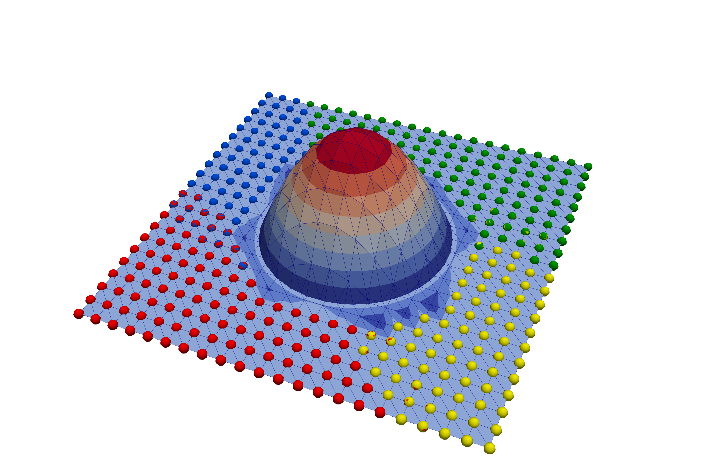

# CutFEMx

a cut finite element library for FEniCSx. The current version supports FEniCSx 0.9 with a customised ffcx version for runtime quadrature at [ffcx-runtime](https://github.com/sclaus2/ffcx).

Poisson problem in a circular domain described by a level set function.