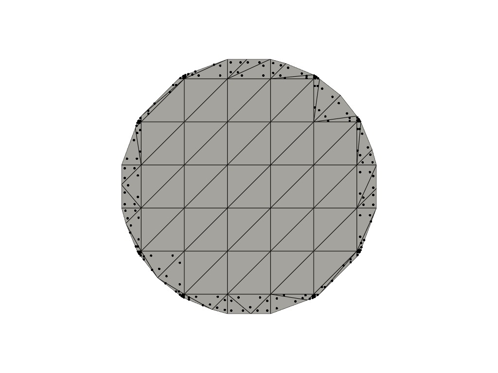

<p align="center">

</p>

CutFEMx is a cut finite element library for FEniCSx. 
It is developed to support cut finite element methods as described in 

```bash
@article{CutFEM2015,
  title={CutFEM: discretizing geometry and partial differential equations},
  author={Burman, Erik and Claus, Susanne and Hansbo, Peter and Larson, Mats G and Massing, Andr{\'e}},
  journal={International Journal for Numerical Methods in Engineering},
  volume={104},
  number={7},
  pages={472--501},
  year={2015},
  publisher={Wiley Online Library}
}
```

The current version supports FEniCSx 0.9 with a customised ffcx version for runtime quadrature at [ffcx-runtime](https://github.com/sclaus2/ffcx-runtime-0.9.0).




Poisson problem in a circular domain described by a level set function.

## Installation Instructions

The CutFEMx library requires a FEniCSx installation version 0.9.0 with an extended version of ffcx from here `git clone git@github.com:sclaus2/ffcx-runtime-0.9.0.git` . CutFEMx also requires CutCells. The installation instructions using conda to manage the dependencies are detailed below. Make sure to use python 3.12. 

1. Create and activate a new conda environment:
    ```bash
    conda create -n cutfemx
    conda activate cutfemx
    ```

2. Install general packages required for the build:
    ```bash
    conda install -c conda-forge cxx-compiler cmake python pkg-config pip nanobind
    ```

3. Install dependencies:
    ```bash
    conda install -c conda-forge numpy scipy sympy numba pyvista pytest
    conda install -c conda-forge blas blas-devel lapack libblas libcblas liblapack liblapacke libtmglib
    conda install -c conda-forge mpi mpich kahip libboost-devel parmetis libscotch libptscotch pugixml spdlog
    conda install -c conda-forge mpi4py petsc4py slepc4py scikit-build-core 
    conda install -c conda-forge 'hdf5=*=mpi*' 'petsc=*=*real*' 'slepc=*=*real*' 'libadios2=*=mpi*'
    ```

4. Install Basix:
    ```bash
    git clone git@github.com:FEniCS/basix.git
    cd basix
    git checkout v0.9.0

    cd cpp
    cmake -DCMAKE_BUILD_TYPE=Release -DCMAKE_INSTALL_PREFIX="$CONDA_PREFIX" -B build-dir -S .
    cmake --build build-dir
    cmake --install build-dir
    
    cd ../python
    pip install .
    ```

5. Install UFL:
    ```bash
    git clone https://github.com/FEniCS/ufl.git
    cd ufl
    git checkout 2024.2.0
    pip install .
    ```

6. Install runtime integral extended FFCX:
    ```bash
    git clone git@github.com:sclaus2/ffcx-runtime-0.9.0.git
    cd ffcx
    pip install .
    ```

7. Install DOLFINx:
    ```bash
    git clone git@github.com:FEniCS/dolfinx.git
    cd dolfinx
    git checkout v0.9.0

    cd cpp
    cmake -DCMAKE_BUILD_TYPE=Release -DCMAKE_INSTALL_PREFIX="$CONDA_PREFIX" -B build-dir -S .
    cmake --build build-dir
    cmake --install build-dir

    cd ../python
    pip install -r build-requirements.txt
    pip install --check-build-dependencies --no-build-isolation .
    ```

8. Install CutCells:
    ```bash
    git clone git@github.com:sclaus2/cutcells.git

    cd cutcells/cpp
    cmake -DCMAKE_BUILD_TYPE=Release -DCMAKE_INSTALL_PREFIX="$CONDA_PREFIX" -B build-dir -S .
    cmake --build build-dir
    cmake --install build-dir

    cd ../python
    pip install .
    ```

9. Install CutFEMx:
    ```bash
    git clone https://github.com/sclaus2/CutFEMx

    cd CutFEMx/cpp
    cmake -DCMAKE_BUILD_TYPE=Release -DCMAKE_INSTALL_PREFIX="$CONDA_PREFIX" -B build-dir -S .
    cmake --build build-dir
    cmake --install build-dir

    cd ../python
    pip install -r build-requirements.txt
    pip install --check-build-dependencies --no-build-isolation .
    pip install --no-build-isolation .
    ```
