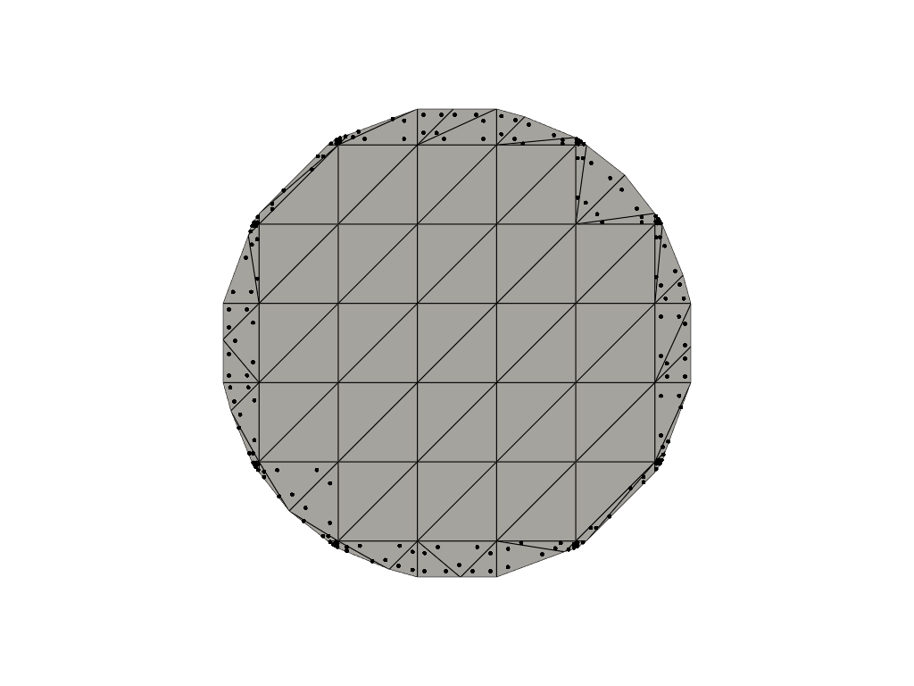
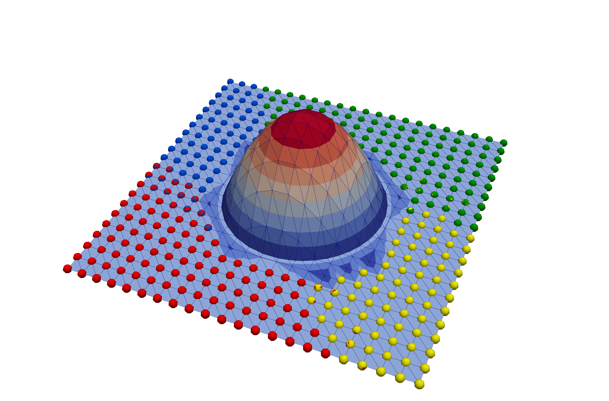
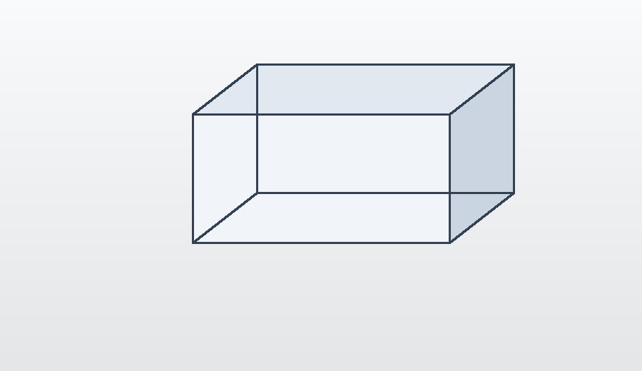
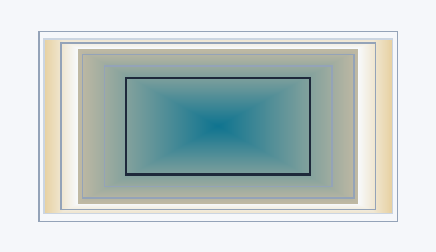

<p align="center">

</p>

CutFEMx is a cut finite element library for FEniCSx. It supports cut finite
element methods as described in

```bibtex
@article{CutFEM2015,
  title={CutFEM: discretizing geometry and partial differential equations},
  author={Burman, Erik and Claus, Susanne and Hansbo, Peter and Larson, Mats G and Massing, Andr{\'e}},
  journal={International Journal for Numerical Methods in Engineering},
  volume={104},
  number={7},
  pages={472--501},
  year={2015},
  publisher={Wiley Online Library}
}
```

The current version targets the FEniCSx 0.11 release stack
(Basix/UFL/FFCx/DOLFINx), with runtime quadrature provided by
[runintgen](https://github.com/sclaus2/runintgen) and cut geometry provided by
[CutCells](https://github.com/sclaus2/cutcells).
The CutFEMx 0.2 release line is intended to be used with runintgen 0.1 and
CutCells 0.4.

## License

CutFEMx is licensed under the MIT License except for DOLFINx-derived form and
assembler sources under `cpp/dolfinx_custom_data`, which are licensed under
LGPL-3.0-or-later. See `THIRD_PARTY_NOTICES.md` for provenance and details.




Poisson problem in a circular domain described by a level set function.

## Features

- **Unfitted discretization**: solve PDEs on geometries defined by level-set
  functions without remeshing.
- **Runtime quadrature**: generate quadrature rules on cut entities with
  CutCells and assemble them through runintgen.
- **Stabilization**: ghost-penalty stabilization for robustness with small cut
  cells.
- **Parallel support**: compatible with MPI-distributed FEniCSx workflows.

The documentation is available at
[https://sclaus2.github.io/CutFEMx/](https://sclaus2.github.io/CutFEMx/).

## Installation

These instructions assume a Unix-like shell and an activated conda-forge
environment. They intentionally avoid user-specific paths; all CMake installs
use the active environment prefix through `$CONDA_PREFIX`.

### 1. Create an environment

Choose any environment name and keep it active for all install steps:

```bash
conda create -n <env-name> -c conda-forge python=3.13
conda activate <env-name>

conda install -c conda-forge \
  c-compiler cxx-compiler cmake ninja pkg-config pip \
  mpi mpich mpi4py petsc petsc4py \
  hdf5 libadios2 pugixml spdlog boost-cpp \
  parmetis libscotch ptscotch kahip \
  numpy scipy matplotlib pyvista pytest \
  scikit-build-core nanobind cffi
```

Use one consistent MPI/PETSc stack for every build step. If you use OpenMPI
instead of MPICH, install matching MPI, PETSc, `mpi4py`, and `petsc4py`
packages from conda-forge.

Before building packages from source, keep CMake and Python discovery tied to
the active environment:

```bash
export CONDA_PREFIX="${CONDA_PREFIX:?activate the conda environment first}"
export CMAKE_PREFIX_PATH="$CONDA_PREFIX"
export PYTHONNOUSERSITE=1
export CC="$CONDA_PREFIX/bin/clang"
export CXX="$CONDA_PREFIX/bin/clang++"
```

On macOS with the conda-forge C++ toolchain, DOLFINx 0.11 may also require:

```bash
export CMAKE_ARGS="-DCMAKE_OSX_DEPLOYMENT_TARGET=13.4"
export CXXFLAGS="-D_LIBCPP_ENABLE_EXPERIMENTAL -D_LIBCPP_HAS_NO_EXPERIMENTAL_TZDB -D_LIBCPP_HAS_NO_EXPERIMENTAL_SYNCSTREAM -D_LIBCPP_HAS_NO_INCOMPLETE_PSTL"
```

On Linux, or with a compiler toolchain that does not need these libc++
workarounds, omit the `CMAKE_ARGS` and `CXXFLAGS` lines. If `clang`/`clang++`
are not the compiler names in your environment, set `CC` and `CXX` to the
compiler wrappers installed in the active conda environment.

### 2. Install the FEniCSx 0.11 release stack

CutFEMx currently targets the FEniCSx 0.11 source release stack:

- Basix: `v0.11.0`
- UFL: `2026.1.0`
- FFCx: `v0.11.0`
- DOLFINx: `v0.11.0`

Verify the upstream tags if needed:

```bash
git ls-remote --exit-code --tags https://github.com/FEniCS/basix.git refs/tags/v0.11.0
git ls-remote --exit-code --tags https://github.com/FEniCS/ufl.git refs/tags/2026.1.0
git ls-remote --exit-code --tags https://github.com/FEniCS/ffcx.git refs/tags/v0.11.0
git ls-remote --exit-code --tags https://github.com/FEniCS/dolfinx.git refs/tags/v0.11.0
```

Fetch the tagged sources:

```bash
mkdir -p fenicsx-0.11
cd fenicsx-0.11

git clone --branch v0.11.0 --depth 1 https://github.com/FEniCS/basix.git
git clone --branch 2026.1.0 --depth 1 https://github.com/FEniCS/ufl.git
git clone --branch v0.11.0 --depth 1 https://github.com/FEniCS/ffcx.git
git clone --branch v0.11.0 --depth 1 https://github.com/FEniCS/dolfinx.git
```

Install Basix, UFL, and FFCx from those checkouts:

```bash
python -m pip install --upgrade pip setuptools wheel

python -m pip install --upgrade --force-reinstall --no-deps ./basix ./ufl ./ffcx
```

Build and install DOLFINx from source into the same environment:

```bash
cd dolfinx

cmake -G Ninja -S cpp -B cpp/build \
  -DCMAKE_BUILD_TYPE=Release \
  -DCMAKE_INSTALL_PREFIX="$CONDA_PREFIX" \
  -DCMAKE_PREFIX_PATH="$CONDA_PREFIX"
cmake --build cpp/build
cmake --install cpp/build

python -m pip install --check-build-dependencies --no-build-isolation --no-deps \
  ./python

cd ../..
```

### 3. Install runintgen

```bash
git clone https://github.com/sclaus2/runintgen.git
cd runintgen

python -m pip install --no-build-isolation --no-deps --force-reinstall .

cd ..
```

### 4. Install CutCells

```bash
git clone https://github.com/sclaus2/cutcells.git CutCells
cd CutCells

cmake -G Ninja -S cpp -B cpp/build \
  -DCMAKE_BUILD_TYPE=Release \
  -DCMAKE_INSTALL_PREFIX="$CONDA_PREFIX" \
  -DCMAKE_PREFIX_PATH="$CONDA_PREFIX" \
  -DCUTCELLS_WITH_ALGOIM=ON
cmake --build cpp/build
cmake --install cpp/build

CMAKE_ARGS="${CMAKE_ARGS:-} -DCUTCELLS_WITH_ALGOIM=ON" \
  python -m pip install --no-build-isolation --no-deps --force-reinstall \
  ./python

cd ..
```

### 5. Install CutFEMx

```bash
git clone https://github.com/sclaus2/CutFEMx.git
cd CutFEMx

env CONDA_PREFIX="$CONDA_PREFIX" \
  CMAKE_PREFIX_PATH="$CONDA_PREFIX" \
  PYTHONNOUSERSITE=1 \
  CC="$CONDA_PREFIX/bin/clang" \
  CXX="$CONDA_PREFIX/bin/clang++" \
  CMAKE_ARGS="-DCMAKE_OSX_DEPLOYMENT_TARGET=13.4 -DCUTCELLS_WITH_ALGOIM=ON" \
  CXXFLAGS="-D_LIBCPP_ENABLE_EXPERIMENTAL -D_LIBCPP_HAS_NO_EXPERIMENTAL_TZDB -D_LIBCPP_HAS_NO_EXPERIMENTAL_SYNCSTREAM -D_LIBCPP_HAS_NO_INCOMPLETE_PSTL" \
  python -m pip install --no-build-isolation --no-deps --force-reinstall .
```

Use the same active conda environment and `pip` flags for `runintgen`,
`CutCells/python`, and CutFEMx. If the build variables above are already
exported, the shorter `python -m pip install ...` form is equivalent. Omit
`-DCUTCELLS_WITH_ALGOIM=ON` only if you intentionally want to build without the
optional Algoim quadrature backend.

`--no-build-isolation` is required because CutFEMx must use the active
FEniCSx/MPI/PETSc/runintgen stack and DOLFINx wrapper headers. `--no-deps`
prevents `pip` from replacing the pinned FEniCSx packages with incompatible
release packages.

Verify the installation:

```bash
python - <<'PY'
import cutcells
import cutfemx
import dolfinx
import runintgen

print("DOLFINx:", dolfinx.__version__)
print("runintgen:", getattr(runintgen, "__version__", "installed"))
print("CutCells:", getattr(cutcells, "__version__", "installed"))
print("CutFEMx:", getattr(cutfemx, "__version__", "installed"))
PY
```

## Building The Documentation

The documentation is a Sphinx/MyST project in `docs/`. Use the same conda
environment that contains CutFEMx and the FEniCSx stack, especially when
regenerating tutorial figures.

Install the documentation dependencies once:

```bash
cd CutFEMx/docs
python -m pip install -r requirements.txt
```

Build the HTML documentation:

```bash
bash build_docs.sh clean
bash build_docs.sh build
```

The generated site is written to `docs/_build/html/index.html`. To serve it
locally:

```bash
bash build_docs.sh serve --port 8000
```

Tutorial screenshots and interactive HTML views are generated from the actual
demo-style CutFEMx solves in `docs/tutorials/make_pyvista_scenes.py`. Regenerate
them before building when the tutorials or demo visualizations change:

```bash
bash build_docs.sh visuals
bash build_docs.sh build
```

Equivalently, generate visuals as part of the build:

```bash
CUTFEMX_DOCS_GENERATE_VISUALS=1 bash build_docs.sh build
```

You can also select a conda environment without activating it first:

```bash
CUTFEMX_DOCS_CONDA_ENV=<env-name> bash build_docs.sh build
```

For a direct Sphinx command, run this from `docs/`:

```bash
make html
```

## Available Demos

The `python/demo` directory contains examples illustrating the usage of CutFEMx:

- **Poisson equation** (`demo_poisson.py`): solve a cut Poisson problem on a
  flower-shaped domain with Nitsche terms and ghost-penalty stabilization.
- **Cut DG Poisson** (`demo_dg_poisson.py`): solve a DG Poisson problem with
  runtime quadrature on cells and the active interior skeleton.
- **Interface Poisson** (`demo_interface_poisson.py`): solve an interface
  problem across level-set-defined subdomains.
- **Quad/hex cut Poisson** (`demo_quad_hex_cuts.py`): cut quadrilateral and
  hexahedral meshes with flower/popcorn level sets, solve a manufactured
  Poisson problem, and optionally write PyVista screenshots.
- **Moving domain** (`demo_moving_poisson.py`): update quadrature rules and
  integration domains as the interface moves.
- **Exterior-facet runtime quadrature** (`demo_boundary_sphere_perimeter.py`):
  integrate on cut exterior facets.
- **Distance from STL** (`demo_stl_distance.py`): compute a signed distance
  field from an STL surface.
- **Level-set reinitialization** (`demo_reinit.py`): convert a distorted level
  set into a signed distance field.

## Geometry and Level Sets

CutFEMx provides tools for handling complex geometries through level-set
functions. The library can generate distance fields from standard STL files and
adaptively refine a background mesh around an STL surface.

<p align="center">
  
  
</p>
<p align="center">
  <i>Example: signed distance field computed from a dino STL surface on an adaptively refined mesh using `demo_stl_distance.py`.</i>
</p>
