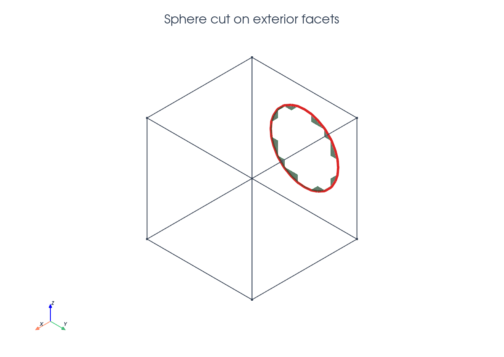
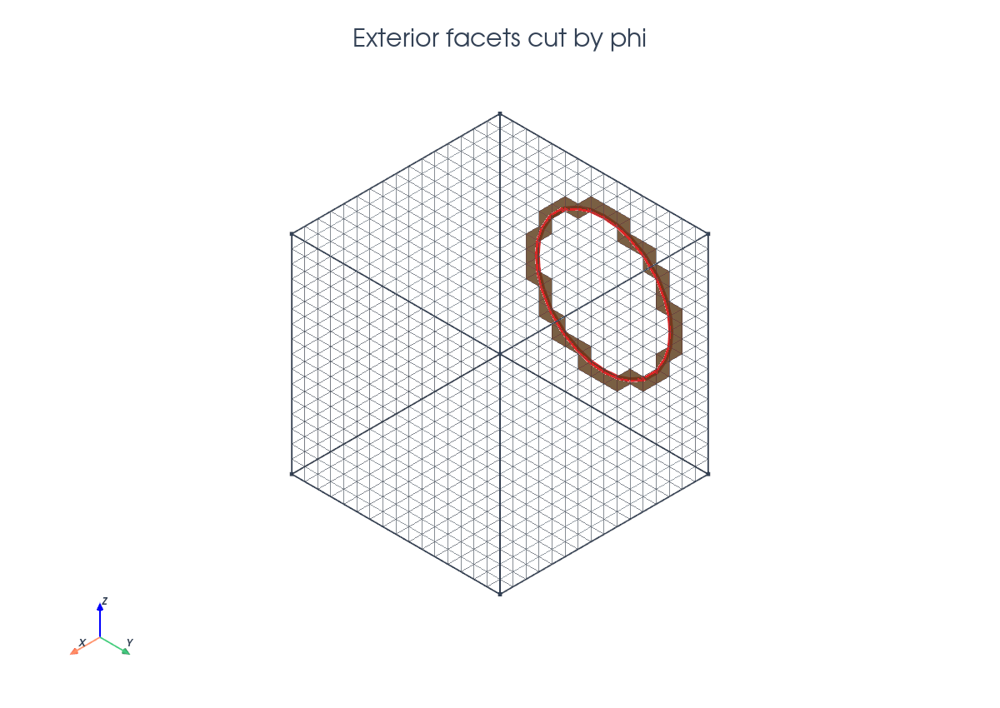
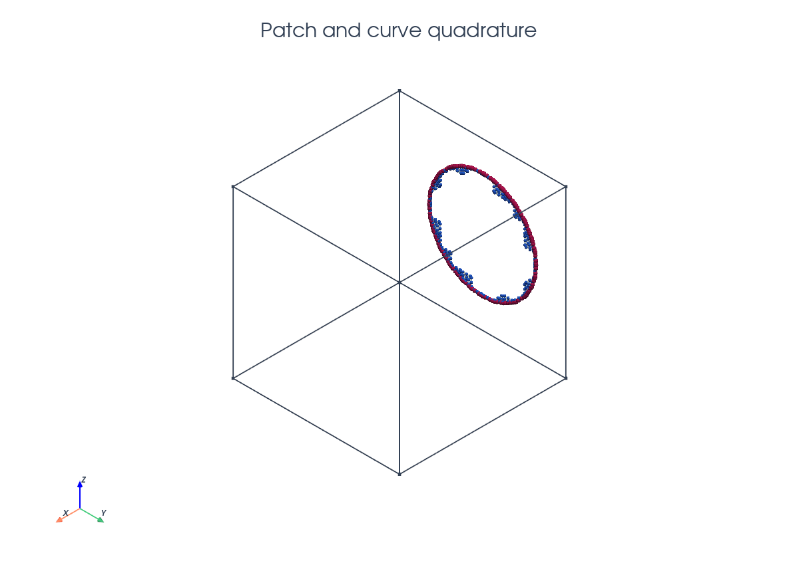

# Exterior-Facet Runtime Quadrature

This tutorial follows `python/demo/demo_boundary_sphere_perimeter.py`. It is a
geometric quadrature example: the entities being cut are exterior facets of a
three-dimensional background mesh, not volume cells.

```{raw} html
<figure class="tutorial-figure">
  
  <figcaption>The sphere cuts the left boundary face of the cube; the green patch is the negative phase on the boundary and the red curve is its perimeter.</figcaption>
</figure>
```

## Geometry

The background mesh covers the unit cube $B=[0,1]^3$. A sphere centered outside
the cube is represented by

$$
\phi(x)=\|x-c\|^2-r^2 .
$$

The chosen center makes $\phi=0$ intersect only the left boundary face. On
that face the negative phase is a disk-like patch

$$
D=\{x\in\partial B:\phi(x)<0\},
$$

and its boundary is the curve

$$
C=\{x\in\partial B:\phi(x)=0\}.
$$

## Implementation Order

The demo runs in this order:

1. Parse `--n`, `--order`, `--radius`, `--center`, and optional plot flags.
2. Validate that the sphere cuts only the left exterior face.
3. Build the unit-cube tetrahedral mesh and interpolate the P1 level set.
4. Pass the exterior facet list and facet dimension to `cutfemx.cut`.
5. Locate full negative exterior facets and cut exterior facets.
6. Build runtime quadrature and cut meshes for `"phi<0"` and `"phi=0"`.
7. Assemble the standard full-facet area, cut-facet patch area, and perimeter.
8. Compare with the exact disk area and circle perimeter, then optionally plot.

## Cutting Exterior Facets

The parent entities are exterior facets, so their dimension is passed
explicitly to `cutfemx.cut`.

```{raw} html
<figure class="tutorial-figure">
  
  <figcaption>Orange facets are the exterior background facets intersected by the zero level set.</figcaption>
</figure>
```

```python
fdim = msh.topology.dim - 1
msh.topology.create_entities(fdim)
msh.topology.create_connectivity(fdim, msh.topology.dim)

exterior_facets = mesh.exterior_facet_indices(msh.topology)
cut_data = cutfemx.cut(phi, exterior_facets, fdim)
```

The selectors keep their usual meaning, but now they act on boundary facets:

```python
negative_facets = cutfemx.locate_entities(cut_data, "phi<0")
cut_facets = cutfemx.locate_entities(cut_data, "phi=0")
```

## Patch And Curve Quadrature

CutFEMx builds one runtime quadrature rule for the cut part of the surface
patch and one for the induced curve. Fully negative exterior facets are not
runtime rules; the demo integrates them with an ordinary `meshtags`-based
`ds` measure and then adds the cut-facet contribution.

```{raw} html
<figure class="tutorial-figure">
  
  <figcaption>Blue points integrate the boundary patch area; magenta points integrate the perimeter curve.</figcaption>
</figure>
```

```python
patch_rules = cutfemx.runtime_quadrature(cut_data, "phi<0", order)
curve_rules = cutfemx.runtime_quadrature(cut_data, "phi=0", order)
patch_mesh = cutfemx.create_cut_mesh(cut_data, "phi<0", mode="cut_only")
curve_mesh = cutfemx.create_cut_mesh(cut_data, "phi=0", mode="cut_only")

one = fem.Constant(msh, np.float64(1.0))
standard_tags = mesh.meshtags(
    msh, fdim, negative_facets, np.full(negative_facets.size, 1, dtype=np.int32)
)
standard_area = _assemble_scalar(
    one * ufl.Measure("ds", domain=msh, subdomain_data=standard_tags)(1)
)
ds_patch = ufl.Measure("ds", domain=msh, subdomain_id=2,
                       subdomain_data=patch_rules)
ds_curve = ufl.Measure("ds", domain=msh, subdomain_id=3,
                       subdomain_data=curve_rules)
```

The assembled quantities are

$$
|D|=\int_{D_\mathrm{full}}1\,ds+\int_{D_\mathrm{cut}}1\,ds,\qquad
|C|=\int_C 1\,d\ell .
$$

Only $D_\mathrm{cut}$ uses runtime quadrature. The patch weights have area
dimension, while the curve weights have length dimension.

## Exact Check

For the left face $x=0$, the curve radius is

$$
\rho=\sqrt{r^2-c_x^2}.
$$

The exact values are therefore

$$
|C|=2\pi\rho,\qquad |D|=\pi\rho^2.
$$

The demo reports these exact values beside the assembled runtime values,
making this a compact verification of exterior-facet and codimension-two
quadrature.

## Run The Demo

```bash
python python/demo/demo_boundary_sphere_perimeter.py
```

## Full Source

The complete source remains available in the repository:
[python/demo/demo_boundary_sphere_perimeter.py](../../python/demo/demo_boundary_sphere_perimeter.py).
