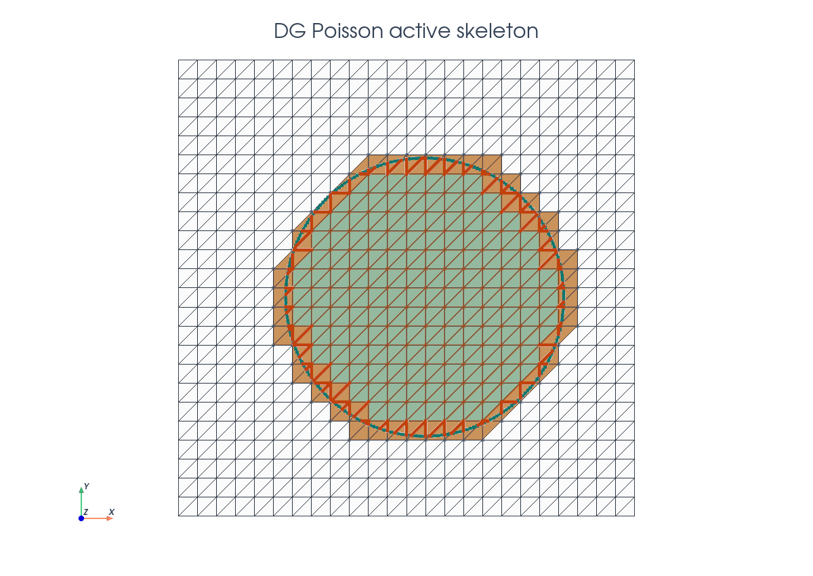
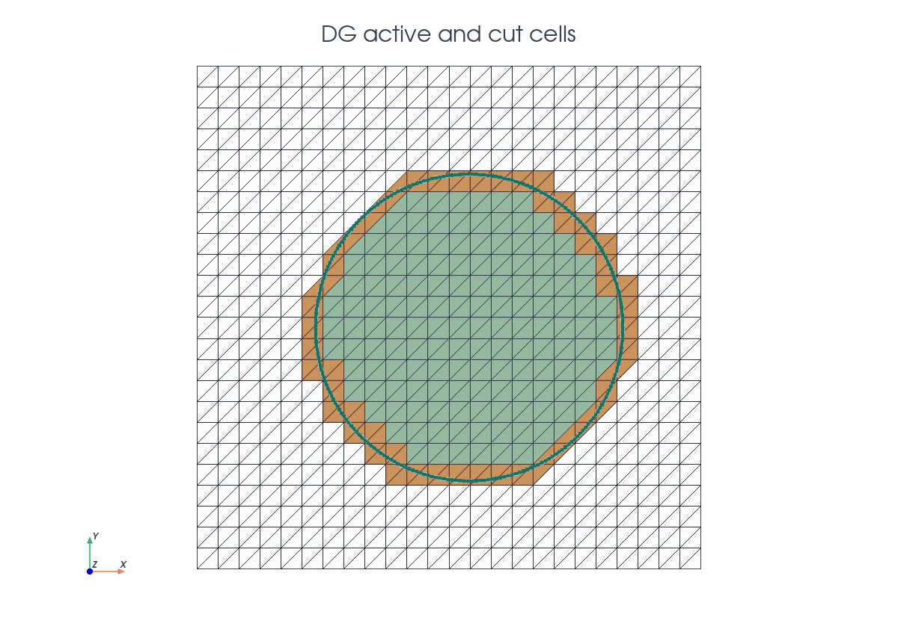
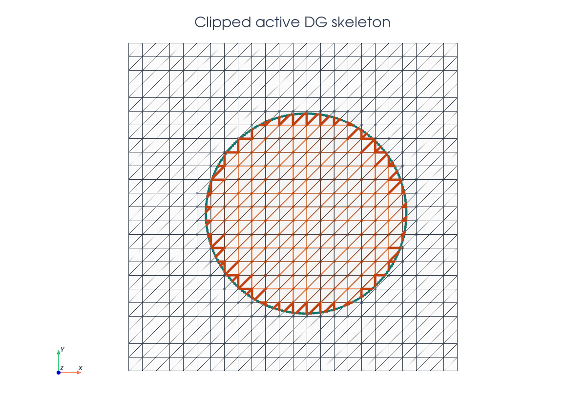
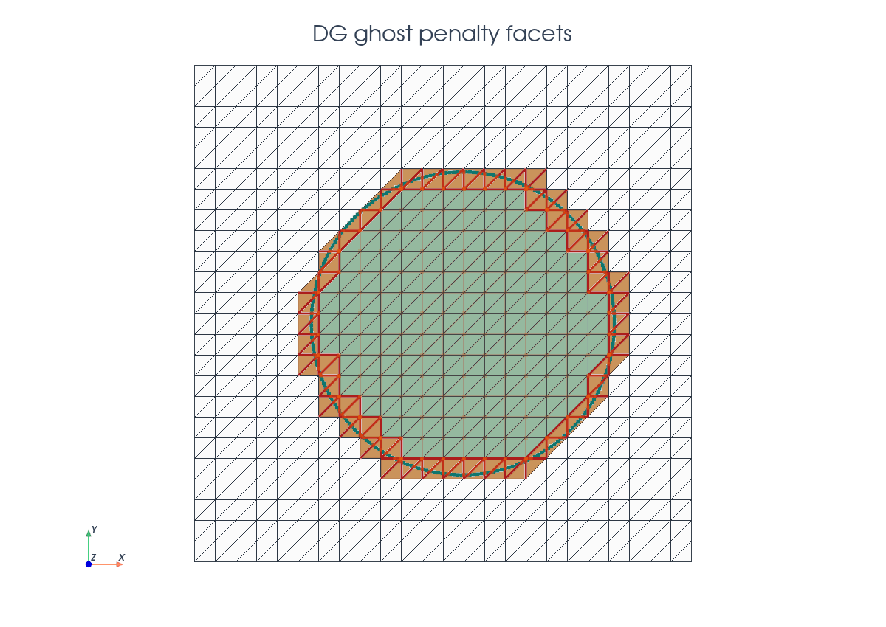
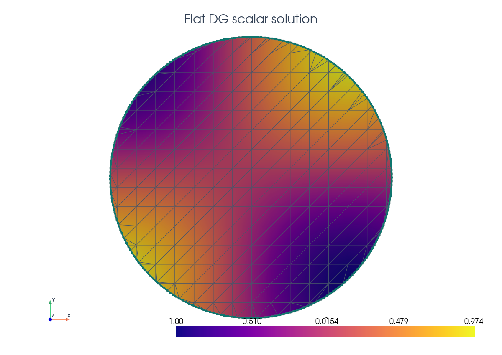

# DG Poisson

This tutorial follows `python/demo/demo_dg_poisson.py`. It extends the scalar
cut Poisson demo to a discontinuous Galerkin space, so the physical cells, the
embedded boundary, and the interior skeleton all become part of the cut
integration problem.
The cut DG formulation is closest to the stabilized cut discontinuous
Galerkin framework cited in the related literature below.

```{raw} html
<figure class="tutorial-figure">
  
  <figcaption>The DG problem is solved on an unfitted circular domain; active cells and the interior skeleton are clipped by the same level set.</figcaption>
</figure>
```

## Model Problem

The physical domain is the negative phase of a circular level set function,

$$
\Omega=\{x\in[-1,1]^2:\phi(x)<0\},\qquad
\phi(x,y)=\sqrt{(x-0.08)^2+(y+0.04)^2}-0.61 .
$$

The demo solves

$$
-\Delta u=f\quad\text{in }\Omega,\qquad u=g\quad\text{on }\Gamma=\{\phi=0\},
$$

with the manufactured field

$$
u_\mathrm{ex}(x,y)=\sin(\pi x)\sin(\pi y).
$$

## Implementation Order

The demo runs in this order:

1. Define the circular level set.
2. Build the triangular background mesh and interpolate the P1 level set.
3. Classify inside/active/cut cells, create cell and interface runtime rules,
   then cut the active interior skeleton.
4. Build `dx_omega`, `dS_omega`, `dx_gamma`, and `dS_ghost`.
5. Build the DG space, SIPG volume/skeleton terms, Nitsche boundary terms, and
   ghost penalty.
6. Assemble, deactivate inactive dofs from the CutFEMx form active domain, and
   solve the serial sparse system.
7. Interpolate exact/error fields, assemble the cut-domain $L^2$ error, print
   diagnostics, and write background plus cut-domain output.

## Geometry And Active Cells

The background mesh is cut once with the level set function, and predicates select the cells required by the DG formulation. Interior cells use ordinary cell integration and cut cells receive
runtime quadrature rules. We also determine the active mesh formed by all interior and intersected cells. The active cell domain is used to obtain all facets that are interior to the active mesh to obtain `skeleton_facets`. We then compute the cut between the level set function and those facets.  

```{raw} html
<figure class="tutorial-figure">
  
  <figcaption>Blue cells are fully inside the disk; orange cells are intersected by the embedded boundary.</figcaption>
</figure>
```

```python
cell_cut = cutfemx.cut(phi)
inside_cells = cutfemx.locate_entities(cell_cut, "phi<0")
active_cells = cutfemx.locate_entities(cell_cut, "phi<=0")
cut_cells = cutfemx.locate_entities(cell_cut, "phi=0")

skeleton_facets = cutfemx.interior_facets_for_cells(msh, active_cells)
skeleton_cut = cutfemx.cut(phi, skeleton_facets, facet_dim)

omega_interior_facets = cutfemx.locate_entities(skeleton_cut, "phi<0")
cut_skeleton_facets = cutfemx.locate_entities(skeleton_cut, "phi=0")

```

## Runtime Quadrature

The DG form uses three kinds of cut quadrature: volume rules on
$K\cap\Omega$, interface rules on $K\cap\Gamma$, and skeleton rules on
$F\cap\Omega$ for active interior facets.

```{raw} html
<figure class="tutorial-figure">
  <iframe class="tutorial-frame" src="../_static/tutorials/dg-poisson-quadrature-view.html" title="Interactive DG Poisson quadrature view" loading="lazy" allowfullscreen></iframe>
  <figcaption>Blue points mark cut-volume rules, magenta points mark embedded-boundary rules, and orange points mark skeleton rules on the clipped interior facets.</figcaption>
</figure>
```

```python
cell_rules = cutfemx.runtime_quadrature(cell_cut, "phi<0", order)
interface_rules = cutfemx.runtime_quadrature(cell_cut, "phi=0", order)

omega_cut_facet_rules = cutfemx.runtime_quadrature(skeleton_cut, "phi<0", order)
```

These rule sets define the measures used by the UFL form:

```python
dx_omega = ufl.Measure(
    "dx", domain=msh, subdomain_id=0, subdomain_data=[inside_cells, cell_rules]
)
dx_gamma = ufl.Measure("dx", domain=msh, subdomain_id=1, subdomain_data=interface_rules)
dS_omega = ufl.Measure(
    "dS",
    domain=msh,
    subdomain_id=0,
    subdomain_data=[omega_interior_facets, omega_cut_facet_rules],
)
```

For the DG skeleton this measure has two pieces. `omega_interior_facets`
contains the full background interior facets that lie inside $\Omega$.
`omega_cut_facet_rules` contains runtime quadrature on the clipped pieces
$F\cap\Omega$ for facets cut by $\Gamma$; its parent map corresponds to the
`cut_skeleton_facets` diagnostic set.

## Active DG Skeleton

The skeleton terms are only integrated on the part of each active interior
facet that belongs to $\Omega$. Facets fully inside $\Omega$ contribute as
ordinary background facets. Intersected facets only contribute on the clipped
segment $F\cap\Omega$, so the background support facet and the integration
facet are not the same geometric object.

```{raw} html
<figure class="tutorial-figure">
  
  <figcaption>Muted orange facets are integrated fully; gray facets are intersected support facets, and the darker orange subsegments are the clipped parts used by `dS_omega`.</figcaption>
</figure>
```

With $h$ the cell diameter and $\sigma$ the DG penalty, the symmetric interior
penalty part has the form

$$
\int_\Omega \nabla u\cdot\nabla v\,dx
-\int_{\mathcal F_h^\Omega}\{\nabla u\}\cdot [v n]\,dS
-\int_{\mathcal F_h^\Omega}\{\nabla v\}\cdot [u n]\,dS
+\int_{\mathcal F_h^\Omega}\frac{\sigma}{h}\,[u n]\cdot[v n]\,dS .
$$

```python
n_facet = ufl.FacetNormal(msh)
h = ufl.CellDiameter(msh)
h_avg = ufl.avg(h)
sigma = penalty * degree**2

a = ufl.inner(ufl.grad(u), ufl.grad(v)) * dx_omega
jump_u = ufl.jump(u, n_facet)
jump_v = ufl.jump(v, n_facet)
a += -ufl.inner(ufl.avg(ufl.grad(u)), jump_v) * dS_omega
a += -ufl.inner(ufl.avg(ufl.grad(v)), jump_u) * dS_omega
a += sigma / h_avg * ufl.inner(jump_u, jump_v) * dS_omega
```

## Boundary And Ghost Stabilization

The Dirichlet condition on $\Gamma$ is imposed with Nitsche terms. A ghost
penalty then couples cut cells to neighboring interior cells, reducing the
conditioning sensitivity caused by very small intersections.

```{raw} html
<figure class="tutorial-figure">
  
  <figcaption>Red facets indicate the ghost-penalty band near the embedded boundary.</figcaption>
</figure>
```

```python
n_gamma = cutfemx.normal(phi)
ghost_facets = cutfemx.ghost_penalty_facets(cell_cut, "phi<0")
dS_ghost = ufl.Measure("dS", domain=msh, subdomain_id=2, subdomain_data=ghost_facets)
```

The boundary terms use the same symmetric Nitsche structure as the continuous
Poisson example, but with the DG interface penalty `sigma_gamma`. The source
term and boundary data use the manufactured exact solution.

```python
sigma_gamma = interface_penalty * degree**2

a += (
    -ufl.dot(ufl.grad(u), n_gamma) * v
    - ufl.dot(ufl.grad(v), n_gamma) * u
    + sigma_gamma / h * u * v
) * dx_gamma

L = f * v * dx_omega
L += (
    -ufl.dot(ufl.grad(v), n_gamma) * u_exact
    + sigma_gamma / h * u_exact * v
) * dx_gamma
```

## Ghost Penalty Implementation

The ghost penalty is assembled on the background facets returned by
`cutfemx.ghost_penalty_facets`. These facets form a narrow band around the cut
cells and couple the DG gradients across neighboring active cells. This keeps
the system better conditioned when the physical domain cuts only a very small
part of a background cell.

In this demo the stabilization penalizes the normal jump of the gradient:

$$
\int_{\mathcal F_\mathrm{ghost}}
\gamma_g h_\mathrm{avg}
\llbracket \nabla u \cdot n_F \rrbracket
\llbracket \nabla v \cdot n_F \rrbracket
\,dS .
$$

In UFL, `ufl.jump(ufl.grad(u), n_facet)` represents this normal gradient jump.
The term is only added when the ghost-facet set is non-empty.

```python
if ghost_facets.size > 0:
    a += (
        ghost_penalty
        * h_avg
        * ufl.inner(
            ufl.jump(ufl.grad(u), n_facet),
            ufl.jump(ufl.grad(v), n_facet),
        )
        * dS_ghost
    )
```

## Solver And Error

The final forms are wrapped as CutFEMx runtime forms. The assembly path builds a
serial sparse `MatrixCSR`, scatters the contributions, deactivates degrees of
freedom outside the active cut domain, and solves the resulting system with
SciPy.

```python
a_form = cutfemx.fem.form(a)
L_form = cutfemx.fem.form(L)

A = cutfemx.fem.assemble_matrix(a_form)
A.scatter_reverse()
b = cutfemx.fem.assemble_vector(L_form)
b.scatter_reverse(la.InsertMode.add)

cutfemx.fem.deactivate_outside(A, b, cutfemx.fem.active_domain(a_form))

from scipy.sparse.linalg import spsolve

uh = fem.Function(V, name="u_h")
uh.x.array[:] = spsolve(A.to_scipy().tocsr(), b.array)
uh.x.scatter_forward()
```

After the solve, the demo interpolates the exact field into the DG space and
computes both a background error function and the cut-domain $L^2$ error using
the same `dx_omega` measure as the variational form.

```python
u_exact_bg = fem.Function(V, name="u_exact")
u_exact_bg.interpolate(lambda x: np.sin(np.pi * x[0]) * np.sin(np.pi * x[1]))
u_exact_bg.x.scatter_forward()

error_bg = fem.Function(V, name="u_error")
error_bg.x.array[:] = uh.x.array - u_exact_bg.x.array
error_bg.x.scatter_forward()

error_form = cutfemx.fem.form((uh - u_exact) ** 2 * dx_omega)
error_sq = cutfemx.fem.assemble_scalar(error_form)
error_sq = comm.allreduce(error_sq, op=MPI.SUM)
```

## Solution Output

The solution is visualized on the cut disk. 

```{raw} html
<figure class="tutorial-figure">
  
  <figcaption>DG poisson solution on cut geometry. </figcaption>
</figure>
```

The output routine writes both the background fields and their restrictions to
the physical cut domain. The cut mesh is an output mesh only.

```python
cut_mesh = cutfemx.create_cut_mesh(cell_cut, "phi<0", mode="full")

phi_cut = cutfemx.fem.cut_function(phi_out, cut_mesh)
uh_cut = cutfemx.fem.cut_function(uh_out, cut_mesh)

cut_path = output_dir / "dg_poisson_cut_domain.xdmf"
with io.XDMFFile(comm, cut_path.as_posix(), "w") as xdmf:
    xdmf.write_mesh(cut_mesh.mesh)
    xdmf.write_function(phi_cut)
    xdmf.write_function(uh_cut)
```

The script writes:

- `dg_poisson_xdmf/dg_poisson_background.xdmf`
- `dg_poisson_xdmf/dg_poisson_cut_domain.xdmf`

## Related Literature

- C. Gürkan and A. Massing,
  ["A stabilized cut discontinuous Galerkin framework for elliptic boundary
  value and interface problems"](https://doi.org/10.1016/j.cma.2018.12.041),
  *Computer Methods in Applied Mechanics and Engineering* 348, 466-499,
  2019. This paper develops the unfitted SIPG/CutDG framework for elliptic
  boundary-value and interface problems, including Poisson problems and
  ghost-penalty stabilization.

## Run The Demo

```bash
python python/demo/demo_dg_poisson.py
```

## Full Source

The complete source remains available in the repository:
[python/demo/demo_dg_poisson.py](../../python/demo/demo_dg_poisson.py).
