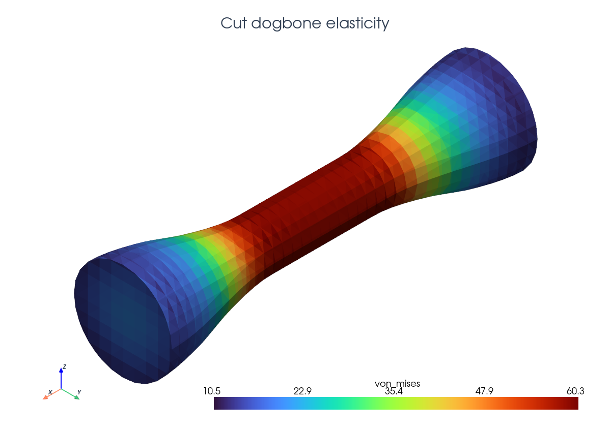
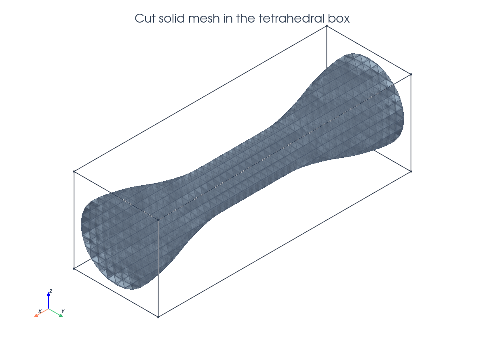
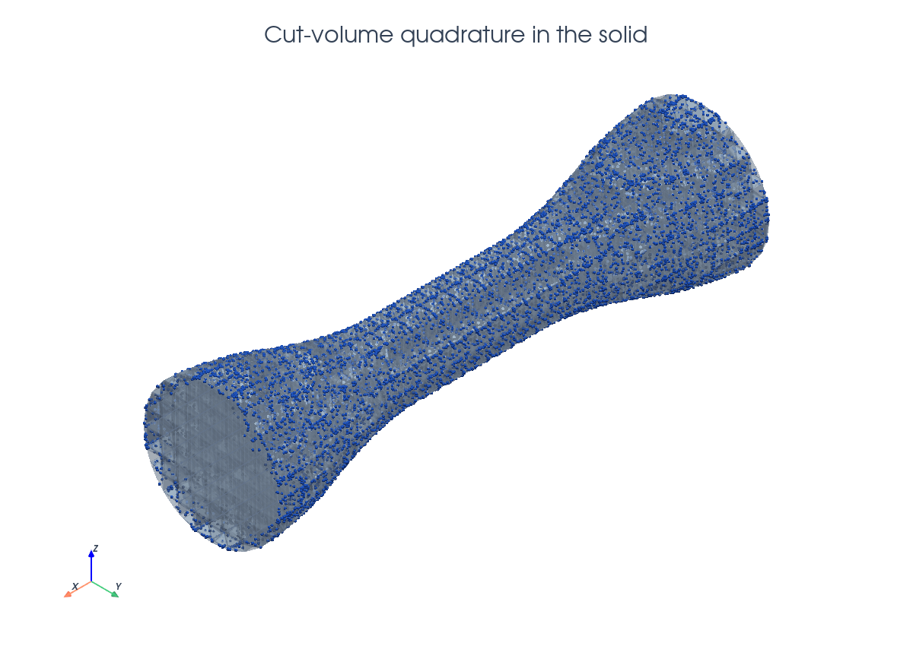
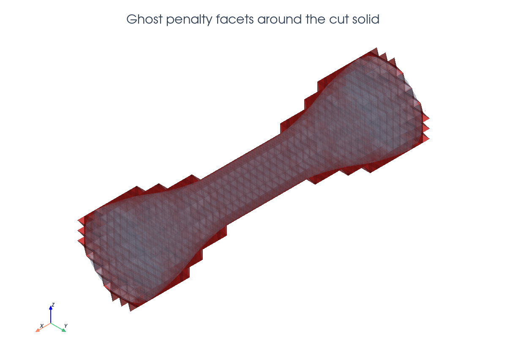
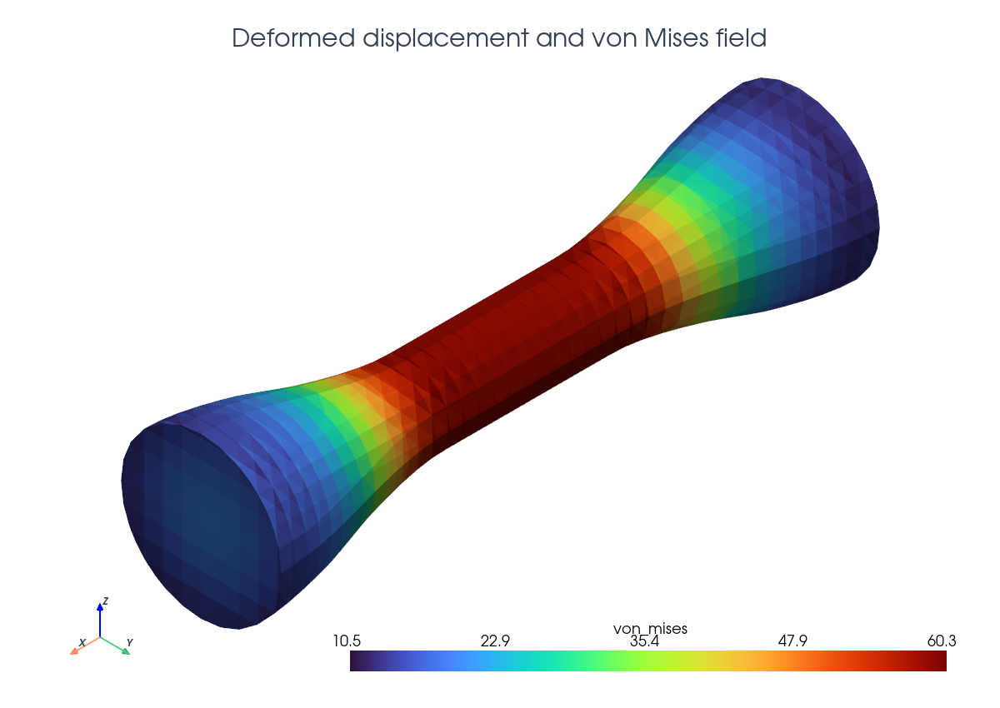

# Elasticity

This tutorial follows `python/demo/demo_elasticity.py`. The physical domain is
a dogbone specimen cut from a tetrahedral background mesh. The left end is
clamped, the right end is pulled in the $x$ direction, and the solid domain is
selected by the negative phase of a level set.
The cut elasticity formulation is related to the linear-elasticity CutFEM
analysis cited in the related literature below.

```{raw} html
<figure class="tutorial-figure">
  
  <figcaption>The final field is shown on the CutFEMx solid mesh extracted from the tetrahedral background mesh.</figcaption>
</figure>
```

## Model

The demo uses small-strain isotropic linear elasticity:

$$
\varepsilon(u)=\operatorname{sym}\nabla u,\qquad
\sigma(u)=2\mu\varepsilon(u)+\lambda\operatorname{tr}(\varepsilon(u))I.
$$

The weak form is

$$
\int_\Omega \sigma(u):\varepsilon(v)\,dx + a_\mathrm{ghost}(u,v)
= \int_\Omega f\cdot v\,dx,
$$

with zero body force in this demo.

## Dogbone Level Set

The solid is defined by the negative phase of a P1 level-set function. For a
point $x=(x_0,x_1,x_2)$, the demo first computes a normalized axial coordinate

$$
t=\operatorname{clip}\left(
\frac{|x_0|-\mathtt{gauge\_half\_length}}
{\mathtt{half\_length}-\mathtt{gauge\_half\_length}},
0,1
\right),
$$

then applies a cubic smoothstep to make the shoulder transition smooth:

$$
s=t^2(3-2t),\qquad
r(x_0)=\mathtt{waist\_radius}
 +(\mathtt{grip\_radius}-\mathtt{waist\_radius})s.
$$

The level set is

$$
\phi(x)=\sqrt{x_1^2+x_2^2}-r(x_0),
$$

so $\phi<0$ selects the dogbone solid, $\phi=0$ is the cut surface, and
$\phi>0$ is outside the specimen.

```python
def dogbone_level_set(
    half_length: float,
    grip_radius: float,
    waist_radius: float,
    gauge_half_length: float,
):
    def phi(x: np.ndarray) -> np.ndarray:
        t = (np.abs(x[0]) - gauge_half_length) / (half_length - gauge_half_length)
        t = np.clip(t, 0.0, 1.0)
        shoulder = t * t * (3.0 - 2.0 * t)
        radius = waist_radius + (grip_radius - waist_radius) * shoulder
        return np.sqrt(x[1] ** 2 + x[2] ** 2) - radius

    return phi
```

## Implementation Order

The demo runs in this order:

1. Define the dogbone level set, strain/stress/von-Mises helpers, serial solve
   helper, and XDMF writer.
2. Build the tetrahedral background mesh and interpolate the P1 level set.
3. Cut the solid, locate `solid_cells`, build `solid_rules`, and select
   `ghost_facets`.
4. Build `dx_solid`, `dS_ghost`, the vector Lagrange space, material constants,
   elasticity bilinear form, and zero body-force linear form.
5. Locate left/right fitted end facets and create the strong displacement
   boundary conditions.
6. Assemble with boundary conditions, apply lifting, deactivate inactive dofs,
   and solve the serial sparse system.
7. Interpolate a DG0 von Mises field, print diagnostics, and write both
   background and cut-solid XDMF outputs.

## Tetrahedral Background And Cut Solid

The background mesh is a box of tetrahedra. The dogbone is represented by a
smooth radius profile in the level-set function, not by a fitted surface mesh.

```{raw} html
<figure class="tutorial-figure">
  
  <figcaption>The visible solid is the generated CutFEMx cut mesh inside the tetrahedral background box.</figcaption>
</figure>
```

```python
msh = mesh.create_box(
    comm,
    (
        np.array([-half_length, -box_radius, -box_radius]),
        np.array([half_length, box_radius, box_radius]),
    ),
    (4 * n, n, n),
    cell_type=mesh.CellType.tetrahedron,
)

phi = fem.Function(V_phi, name="phi")
phi.interpolate(dogbone_level_set(half_length, grip_radius, waist_radius, gauge_half_length))
phi.x.scatter_forward()

cut_data = cutfemx.cut(phi)
solid_cells = cutfemx.locate_entities(cut_data, "phi<0")
```

## Cut-Volume Quadrature

The volume integral is evaluated on the part of each cut tetrahedron belonging
to the solid. Interior solid cells and cut-cell runtime rules are combined in
one measure.

```{raw} html
<figure class="tutorial-figure">
  
  <figcaption>Blue markers show a subsample of the physical cut-volume quadrature points.</figcaption>
</figure>
```

```python
solid_rules = cutfemx.runtime_quadrature(cut_data, "phi<0", order)
dx_solid = ufl.Measure(
    "dx", domain=msh, subdomain_id=0, subdomain_data=[solid_cells, solid_rules]
)
```

## Ghost Stabilization

The ghost penalty stabilizes displacement gradients across facets near the cut
surface.

```{raw} html
<figure class="tutorial-figure">
  
  <figcaption>Red facets indicate the ghost-penalty facets selected around the cut solid.</figcaption>
</figure>
```

```python
ghost_facets = cutfemx.ghost_penalty_facets(cut_data, "phi<0")
dS_ghost = ufl.Measure("dS", domain=msh, subdomain_id=1, subdomain_data=ghost_facets)

a = ufl.inner(sigma(u, mu, lmbda, gdim), epsilon(v)) * dx_solid
if ghost_facets.size > 0:
    n_facet = ufl.FacetNormal(msh)
    h_avg = ufl.avg(ufl.CellDiameter(msh))
    a += gamma_ghost * (2.0 * mu + lmbda) * h_avg * ufl.inner(
        ufl.jump(ufl.grad(u), n_facet),
        ufl.jump(ufl.grad(v), n_facet),
    ) * dS_ghost
```

## Boundary Conditions

The mechanical boundary conditions are fitted on the box ends: all components
are fixed on the left, and the $x$ component is prescribed on the right.

```python
left_facets = mesh.locate_entities_boundary(
    msh, facet_dim, lambda x: np.isclose(x[0], -half_length)
)
right_facets = mesh.locate_entities_boundary(
    msh, facet_dim, lambda x: np.isclose(x[0], half_length)
)

u_left = fem.Function(V)
left_dofs = fem.locate_dofs_topological(V, facet_dim, left_facets)
bcs = [fem.dirichletbc(u_left, left_dofs)]

Vx, _ = V.sub(0).collapse()
u_right_x = fem.Function(Vx)
u_right_x.interpolate(lambda x: pull * np.ones_like(x[0]))
right_x_dofs = fem.locate_dofs_topological((V.sub(0), Vx), facet_dim, right_facets)
bcs.append(fem.dirichletbc(u_right_x, right_x_dofs, V.sub(0)))
```

## Assembly And Solve

The solver helper follows the actual CutFEMx MatrixCSR path. Boundary
conditions are applied during matrix assembly, the right-hand side is lifted,
inactive dofs are deactivated from the form active domain, and SciPy solves the
serial sparse matrix.

```python
a_form = cutfemx.fem.form(a)
L_form = cutfemx.fem.form(L)

A = cutfemx.fem.assemble_matrix(a_form, bcs=bcs)
A.scatter_reverse()
b = cutfemx.fem.assemble_vector(L_form)
cutfemx.fem.apply_lifting(b.array, [a_form], [bcs])
b.scatter_reverse(la.InsertMode.add)
fem.set_bc(b.array, bcs)

active = cutfemx.fem.active_domain(a_form)
cutfemx.fem.deactivate_outside(A, b, active)

uh = fem.Function(V, name="deformation")
uh.x.array[:] = spsolve(A.to_scipy().tocsr(), b.array)
uh.x.scatter_forward()
```

## Stress Output

After solving, the demo interpolates a cellwise DG0 von Mises field from the
computed displacement and writes both background and cut-solid output. The
tutorial view below shows the deformed cut mesh colored by that computed von
Mises field.

```{raw} html
<figure class="tutorial-figure">
  
  <figcaption>The deformed CutFEMx solid mesh is color-mapped by the computed DG0 von Mises field.</figcaption>
</figure>
```

The script writes background and cut-solid deformation and von Mises stress
fields in `elasticity_xdmf/`.

## Related Literature

- P. Hansbo, M. G. Larson, and K. Larsson,
  ["Cut Finite Element Methods for Linear Elasticity Problems"](https://doi.org/10.1007/978-3-319-71431-8_2),
  in *Geometrically Unfitted Finite Element Methods and Applications*,
  Lecture Notes in Computational Science and Engineering, 25-63, 2017. This
  chapter develops CutFEM formulations for linear elasticity on unfitted
  domains, including stabilization near the cut boundary and condition-number
  estimates.
- E. Burman, D. Elfverson, P. Hansbo, M. G. Larson, and K. Larsson,
  ["Shape Optimization Using the Cut Finite Element Method"](https://doi.org/10.1016/j.cma.2017.09.005),
  *Computer Methods in Applied Mechanics and Engineering* 328, 242-261,
  2018. This gives related elasticity examples where a level-set-defined
  elastic domain is evolved without remeshing.

## Run The Demo

```bash
python python/demo/demo_elasticity.py
```

## Full Source

The complete source remains available in the repository:
[python/demo/demo_elasticity.py](../../python/demo/demo_elasticity.py).
