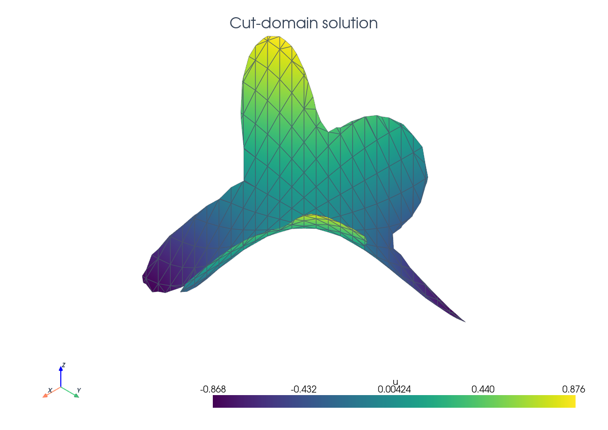

# Tutorial Visualizations

The tutorial pages embed PyVista screenshots and selected docs-native
interactive SVG views from `docs/_static/tutorials/`.
Generate them with:

```bash
cd docs
./build_docs.sh visuals
```

or as part of a docs build:

```bash
cd docs
CUTFEMX_DOCS_GENERATE_VISUALS=1 ./build_docs.sh build
```

The checked-in generator is `docs/tutorials/make_pyvista_scenes.py`. It creates
the same DOLFINx meshes as the demo scripts, runs the same CutFEMx
classification and quadrature setup where practical, converts those meshes to
PyVista grids, and writes PNG screenshots with `Plotter.screenshot`. Dense
panels may also write self-contained SVG or canvas JavaScript HTML files using
the same mesh and quadrature arrays so readers can zoom or rotate without
raster pixelation. The
tutorial pages intentionally use several staged files so each code section can
show the corresponding geometry: background mesh, active cells, cut cells,
quadrature points, skeleton facets, ghost penalty facets, and solution output.

Generated scenes use a light background and PyVista's VTK renderer. Avoid dark
or black render backgrounds for tutorial panels. Do not embed PyVista
`Plotter.export_html` output unless the exact generated file has been tested in
the built docs. Some `trame-vtk`/VTK.js versions can open to a generic empty
viewer placeholder in the built docs even when the serialized scene is present.

For scenes based directly on XDMF output, use the same target directory. If
your platform supports PyVista off-screen rendering, a typical workflow is:

```python
import pyvista as pv

mesh = pv.read("poisson_xdmf/poisson_cut_domain.xdmf")
plotter = pv.Plotter(off_screen=True)
plotter.add_mesh(mesh, scalars="u_h", show_edges=True)
plotter.screenshot("docs/_static/tutorials/poisson-solution-scene.png")
```

Then update the corresponding tutorial page if the filename changes:

```html

<iframe class="tutorial-frame" src="../_static/tutorials/poisson-solution-view.html" title="Interactive tutorial visualization" loading="lazy" allowfullscreen></iframe>
```

Keep generated visualization files in `_static/tutorials/` so Sphinx copies
them into the HTML build. The numerical scripts remain in `python/demo`; the
docs present curated rendered views rather than re-run expensive demos by
default.
