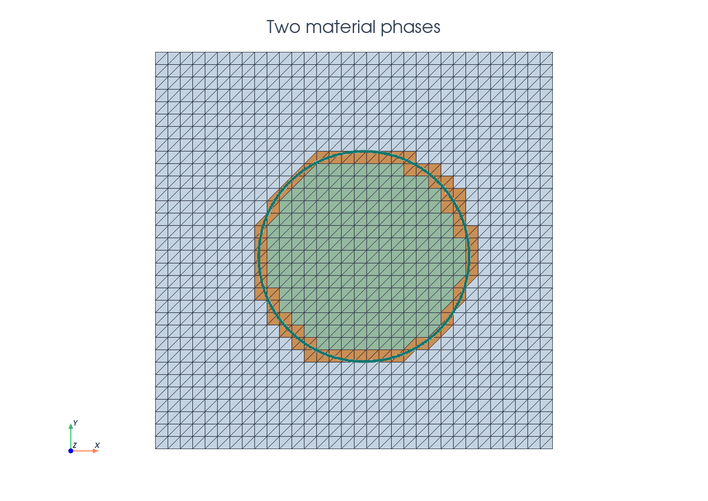
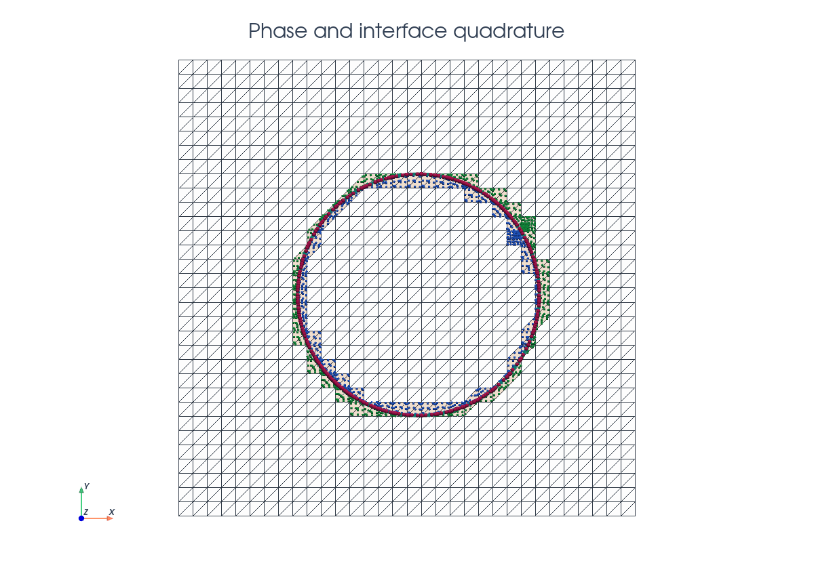
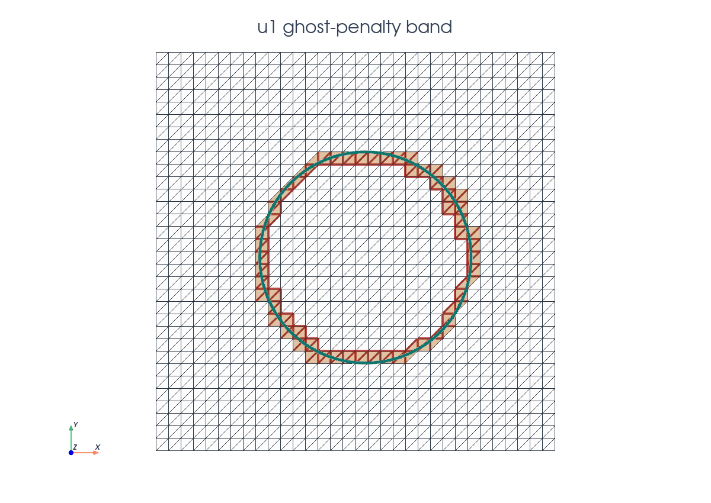
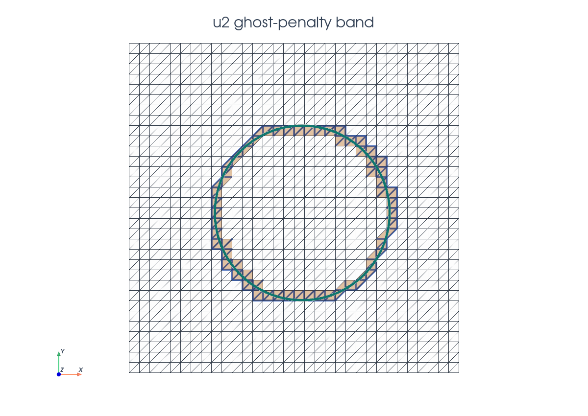

# Interface Poisson

This tutorial follows `python/demo/demo_interface_poisson.py` and presents a multi-domain Poisson problem. The Nitsche coupling over the unfitted interface is related to the CutFEM
interface literature listed in the related literature below.

```{raw} html
<figure class="tutorial-figure">
  <iframe class="tutorial-frame" src="../_static/tutorials/interface-poisson-solution-view.html" title="Interactive warped interface Poisson solution view" loading="lazy" allowfullscreen></iframe>
  <figcaption> Multi-domain poisson problem with contrast in diffusivities.</figcaption>
</figure>
```

## Model Problem

Let $\Omega_0=[-1,1]^2$ be the background domain. A circular level set partitions
this box into two material phases,

$$
\Omega_1=\{x:\phi(x)<0\},\qquad
\Omega_2=\{x:\phi(x)>0\},\qquad
\Gamma=\{x:\phi(x)=0\}.
$$

The demo uses

$$
\phi(x,y)=\sqrt{(x-x_c)^2+(y-y_c)^2}-R,
$$

with $(x_c,y_c)=(0.05,-0.03)$ and $R=0.53$ by default. In each phase it solves

$$
-\nabla\cdot(\kappa_i\nabla u_i)=f_i
\quad\text{in }\Omega_i,\qquad i=1,2,
$$

with transmission conditions on the internal interface,

$$
u_1-u_2=0,\qquad
\kappa_1\nabla u_1\cdot n_\Gamma
-\kappa_2\nabla u_2\cdot n_\Gamma=0
\quad\text{on }\Gamma.
$$

The manufactured solution is continuous and has balanced normal flux:

$$
u_1=(x-x_c)^2+(y-y_c)^2,
$$

and

$$
u_2=\frac{\kappa_1}{\kappa_2}
\left((x-x_c)^2+(y-y_c)^2\right)
+R^2\left(1-\frac{\kappa_1}{\kappa_2}\right).
$$

With these choices both right-hand sides are

$$
f_1=f_2=-4\kappa_1.
$$

## Implementation Order

1. Define level set function.
2. Interpolate the P1 circular level set and build `cut_data`.
3. Locate inside/outside cells, create phase/interface runtime quadrature, and
   select separate ghost-facet bands for the two phase fields.
4. Build phase, interface, ghost, and outer-boundary measures.
5. Create two scalar background spaces and a UFL `MixedFunctionSpace`.
6. Build manufactured fields, bulk diffusion terms, Nitsche interface coupling,
   ghost penalties, and the weak outer boundary condition for `u2`.
7. Extract UFL blocks, wrap them as CutFEMx forms, compute the two active
   domains, and call `solve_block_system(...)`.
8. Assemble errors and interface jump diagnostics, optionally plot, and write
   `<prefix>_u1.xdmf` and `<prefix>_u2.xdmf`.

## Imports

The script uses DOLFINx for the background mesh and fields, UFL for the block
weak form, CutFEMx for cut classification, runtime quadrature, normals,
assembly, active-domain handling, and physical cut-mesh output.

```python
from pathlib import Path

from mpi4py import MPI

import cutfemx
import numpy as np
import ufl
from dolfinx import default_scalar_type, fem, io, la, mesh
from scipy.sparse import bmat
from scipy.sparse.linalg import spsolve
```

## Background Mesh

The interface is not fitted to the mesh. Both phase fields are defined on the
same triangular background mesh, and CutFEMx restricts each field to the
physical part of the mesh through phase-dependent measures and active domains.

```python
comm = MPI.COMM_WORLD
n = 24

msh = mesh.create_rectangle(
    comm,
    ((-1.0, -1.0), (1.0, 1.0)),
    (n, n),
    cell_type=mesh.CellType.triangle,
)
fdim = msh.topology.dim - 1
msh.topology.create_entities(fdim)
msh.topology.create_connectivity(fdim, msh.topology.dim)
exterior_facets = mesh.exterior_facet_indices(msh.topology)
```

## Level Set Function

The level set is represented by a standard P1 function on the background mesh.
The sign of this function determines the two material phases.

```python
radius = 0.53
center = (0.05, -0.03)

V_phi = fem.functionspace(msh, ("Lagrange", 1))
phi = fem.Function(V_phi, name="phi")
phi.interpolate(
    lambda x: np.sqrt((x[0] - center[0]) ** 2
                      + (x[1] - center[1]) ** 2) - radius
)
```

## Phase Cells

One call to `cutfemx.cut` builds the geometric state. The negative phase is the
inside disk, the positive phase is the outside material, and `"phi=0"` selects
the cells cut by the interface.

```{raw} html
<figure class="tutorial-figure">
  
  <figcaption>Green cells belong to the negative phase, blue cells belong to the positive phase, and orange cells are cut by the interface.</figcaption>
</figure>
```

```python
cut_data = cutfemx.cut(phi)
inside_cells = cutfemx.locate_entities(cut_data, "phi<0")
outside_cells = cutfemx.locate_entities(cut_data, "phi>0")
```

These cell lists identify ordinary uncut cells in each phase. Cut cells are
handled by runtime quadrature rather than by modifying the background mesh.

## Runtime Quadrature

Runtime quadrature provides physical integration points for each phase and for
the interface. The phase rules integrate $K\cap\Omega_i$ on cut cells; the
interface rule integrates $K\cap\Gamma$.

```{raw} html
<figure class="tutorial-figure">
  
  <figcaption>Blue and green markers are cut-volume quadrature for the two phases; magenta markers are interface quadrature points.</figcaption>
</figure>
```

```python
order = 4
inside_rules = cutfemx.runtime_quadrature(cut_data, "phi<0", order)
outside_rules = cutfemx.runtime_quadrature(cut_data, "phi>0", order)
interface_rules = cutfemx.runtime_quadrature(cut_data, "phi=0", order)
```

The standard cells and runtime rules are combined in UFL measures:

```python
dx1 = ufl.Measure(
    "dx", domain=msh, subdomain_id=1,
    subdomain_data=[inside_cells, inside_rules],
)
dx2 = ufl.Measure(
    "dx", domain=msh, subdomain_id=2,
    subdomain_data=[outside_cells, outside_rules],
)
dgamma = ufl.Measure("dx", domain=msh, subdomain_id=3,
                     subdomain_data=interface_rules)
```

The interface measure is written as a UFL `"dx"` measure because the interface
quadrature is immersed in volume cells representing a line integral over $\Gamma$.

## Phase Spaces

The two phases use separate scalar fields on the same background mesh. This is
important: the traces of $u_1$ and $u_2$ on $\Gamma$ are independent until the
interface terms couple them.

```python
V1 = fem.functionspace(msh, ("Lagrange", 1))
V2 = fem.functionspace(msh, ("Lagrange", 1))
W_block = ufl.MixedFunctionSpace(V1, V2)

u1, u2 = ufl.TrialFunctions(W_block)
v1, v2 = ufl.TestFunctions(W_block)
```

`ufl.MixedFunctionSpace(V1, V2)` is used here to express the coupled weak form
as a two-field block problem. It does not create one physical mixed finite
element field for output; instead, it gives UFL a product space with one
component for the inside phase and one component for the outside phase. The
trial functions `u1` and `u2` therefore remain associated with the separate
background spaces `V1` and `V2`, but interface terms can still contain both
fields in the same expression.

This is what lets the demo write the interface coupling once as a single UFL
form and then split it into the four matrix blocks

$$
\begin{pmatrix}
A_{11} & A_{12}\\
A_{21} & A_{22}
\end{pmatrix}
\begin{pmatrix}
u_1\\
u_2
\end{pmatrix}
=
\begin{pmatrix}
b_1\\
b_2
\end{pmatrix}.
$$

The diagonal blocks are the phase diffusion, boundary, and ghost-penalty terms.
The off-diagonal blocks come only from the Nitsche interface coupling, where
the jump $u_1-u_2$ and weighted flux terms involve both phases.

## Manufactured Fields

The exact fields are built from the radial coordinate around the interface
center. The outside field is scaled so that the solution and the normal flux
match the inside field at $r=R$.

```python
x = ufl.SpatialCoordinate(msh)
r2 = (x[0] - center_x) ** 2 + (x[1] - center_y) ** 2
ratio = kappa_1 / kappa_2

u1_exact = r2
u2_exact = ratio * r2 + radius**2 * (1.0 - ratio)

f1 = fem.Constant(msh, default_scalar_type(-4.0 * kappa_1))
f2 = fem.Constant(msh, default_scalar_type(-4.0 * kappa_1))
```

## Bulk Terms

Each phase contributes an ordinary diffusion form on its own cut-domain
measure. There is no direct coupling in the volume terms.

```python
a = kappa_1 * ufl.inner(ufl.grad(u1), ufl.grad(v1)) * dx1
a += kappa_2 * ufl.inner(ufl.grad(u2), ufl.grad(v2)) * dx2

L = f1 * v1 * dx1 + f2 * v2 * dx2
```

## Nitsche Interface Coupling

The continuity and flux-balance conditions are imposed weakly on $\Gamma$ with
a weighted symmetric Nitsche form. CutFEMx computes the interface normal from the level-set field:

```python
n_gamma = cutfemx.normal(phi)
h = ufl.CellDiameter(msh)

kappa_h = 2.0 * kappa_1 * kappa_2 / (kappa_1 + kappa_2)
eta_interface = gamma_interface * kappa_h / h
w1 = kappa_2 / (kappa_1 + kappa_2)
w2 = kappa_1 / (kappa_1 + kappa_2)
```

With jump $[u]=u_1-u_2$ and weighted normal flux

$$
\{\kappa\nabla u\cdot n\}_w
=w_1\kappa_1\nabla u_1\cdot n_\Gamma
+w_2\kappa_2\nabla u_2\cdot n_\Gamma,
$$

the interface contribution is

$$
\int_\Gamma
\left(
-\{\kappa\nabla u\cdot n\}_w[v]
-\{\kappa\nabla v\cdot n\}_w[u]
+\eta_\Gamma [u][v]
\right)\,ds.
$$

```python
jump_u = u1 - u2
jump_v = v1 - v2

flux_u = w1 * kappa_1 * ufl.dot(ufl.grad(u1), n_gamma)
flux_u += w2 * kappa_2 * ufl.dot(ufl.grad(u2), n_gamma)

flux_v = w1 * kappa_1 * ufl.dot(ufl.grad(v1), n_gamma)
flux_v += w2 * kappa_2 * ufl.dot(ufl.grad(v2), n_gamma)

a += (-flux_u * jump_v - flux_v * jump_u
      + eta_interface * jump_u * jump_v) * dgamma
```

## Ghost Penalty Facets

Both fields need their own ghost-penalty band because each field has a
different active domain. The inside band stabilizes the $u_1$ block; the
outside band stabilizes the $u_2$ block.

```{raw} html
<figure class="tutorial-figure">
  
  <figcaption>The red band marks the ghost-penalty facets used to stabilize the inside field $u_1$.</figcaption>
</figure>
```

```{raw} html
<figure class="tutorial-figure">
  
  <figcaption>The blue band marks the ghost-penalty facets used to stabilize the outside field $u_2$.</figcaption>
</figure>
```

```python
ghost_facets_1 = cutfemx.ghost_penalty_facets(cut_data, "phi<0")
ghost_facets_2 = cutfemx.ghost_penalty_facets(cut_data, "phi>0")

dS_ghost_1 = ufl.Measure("dS", domain=msh, subdomain_id=4,
                         subdomain_data=ghost_facets_1)
dS_ghost_2 = ufl.Measure("dS", domain=msh, subdomain_id=5,
                         subdomain_data=ghost_facets_2)

n_facet = ufl.FacetNormal(msh)
h_avg = ufl.avg(h)
```

The stabilization terms are added only when the corresponding facet set is
non-empty:

```python
if ghost_facets_1.size > 0 and gamma_ghost != 0.0:
    a += (
        gamma_ghost * kappa_1 * h_avg
        * ufl.inner(
            ufl.jump(ufl.grad(u1), n_facet),
            ufl.jump(ufl.grad(v1), n_facet),
        )
        * dS_ghost_1
    )

if ghost_facets_2.size > 0 and gamma_ghost != 0.0:
    a += (
        gamma_ghost * kappa_2 * h_avg
        * ufl.inner(
            ufl.jump(ufl.grad(u2), n_facet),
            ufl.jump(ufl.grad(v2), n_facet),
        )
        * dS_ghost_2
    )
```

## Outer Boundary

The outside phase touches the boundary of the background box. The demo imposes
the manufactured outer boundary value for $u_2$ weakly by Nitsche terms on the
exterior facets.

```python
ds_outer = ufl.Measure("ds", domain=msh, subdomain_id=6,
                       subdomain_data=exterior_facets)
eta_boundary = gamma_boundary * kappa_2 / h

a += (
    -kappa_2 * ufl.dot(ufl.grad(u2), n_facet) * v2
    - kappa_2 * ufl.dot(ufl.grad(v2), n_facet) * u2
    + eta_boundary * u2 * v2
) * ds_outer

L += (
    -kappa_2 * ufl.dot(ufl.grad(v2), n_facet) * u2_exact
    + eta_boundary * u2_exact * v2
) * ds_outer
```

The inside phase does not touch the outer box boundary in this configuration,
so it has no outer-boundary condition.

## Block Assembly

The UFL block form is split into four matrix blocks and two right-hand-side
blocks. Each block is wrapped as a CutFEMx runtime form before assembly.

```python
a_blocks = ufl.extract_blocks(a)
L_blocks = ufl.extract_blocks(L)

a_forms = tuple(
    tuple(cutfemx.fem.form(a_blocks[i][j]) for j in range(2))
    for i in range(2)
)
L_forms = tuple(cutfemx.fem.form(L_blocks[i]) for i in range(2))
```

Each diagonal block carries a different active domain. After assembly,
CutFEMx deactivates the inactive degrees of freedom in each block row before
the two-by-two sparse block system is passed to SciPy.

```python
domain1 = cutfemx.fem.active_domain(a_forms[0][0])
domain2 = cutfemx.fem.active_domain(a_forms[1][1])

A_matrix_blocks = [
    [_assemble_matrix_block(a_forms[i][j]) for j in range(2)]
    for i in range(2)
]
b_vector_blocks = [_assemble_vector_block(L_forms[i]) for i in range(2)]

cutfemx.fem.deactivate_outside_blocks(
    A_matrix_blocks, [domain1, domain2], b_vector_blocks
)
```

The demo checks that no zero rows remain after deactivation. This catches
missing stabilization or active-domain mistakes before the solve.

## Solve And Diagnostics

The demo assembles the serial SciPy block matrix, solves it, and scatters the
two background fields.

```python
A = bmat(
    [[A.to_scipy().tocsr() for A in row] for row in A_matrix_blocks],
    format="csr",
)
b = np.concatenate([block.array.copy() for block in b_vector_blocks])
n1 = b_vector_blocks[0].array.size

solution = spsolve(A, b)

u1_h = fem.Function(V1, name="u1_h")
u2_h = fem.Function(V2, name="u2_h")
u1_h.x.array[:] = solution[:n1]
u2_h.x.array[:] = solution[n1:]
u1_h.x.scatter_forward()
u2_h.x.scatter_forward()
```

After the solve, the script reports the phase-wise $L^2$ errors and the
interface jump norm:

```python
e1 = cutfemx.fem.assemble_scalar(
    cutfemx.fem.form((u1_h - u1_exact) ** 2 * dx1)
)
e2 = cutfemx.fem.assemble_scalar(
    cutfemx.fem.form((u2_h - u2_exact) ** 2 * dx2)
)
jump_error = cutfemx.fem.assemble_scalar(
    cutfemx.fem.form((u1_h - u2_h) ** 2 * dgamma)
)
```

## Solution Output

The final fields are written on physical cut meshes. As in the scalar cut
Poisson tutorial, these meshes are visualization/output meshes only.

```python
inside_mesh = cutfemx.create_cut_mesh(cut_data, "phi<0", mode="full")
outside_mesh = cutfemx.create_cut_mesh(cut_data, "phi>0", mode="full")

u1_cut = cutfemx.fem.cut_function(u1_h, inside_mesh)
u2_cut = cutfemx.fem.cut_function(u2_h, outside_mesh)
```

The script writes:

- `interface_poisson_u1.xdmf`
- `interface_poisson_u2.xdmf`

## Related Literature

- E. Burman, S. Claus, P. Hansbo, M. G. Larson, and A. Massing,
  ["CutFEM: Discretizing Geometry and Partial Differential Equations"](https://doi.org/10.1002/nme.4823),
  *International Journal for Numerical Methods in Engineering* 104(7),
  472-501, 2015. This is the main CutFEM reference for the unfitted
  Nitsche formulation and ghost stabilization used in this example.

## Run The Demo

```bash
python python/demo/demo_interface_poisson.py
```

## Full Source

The complete source remains available in the repository:
[python/demo/demo_interface_poisson.py](../../python/demo/demo_interface_poisson.py).
