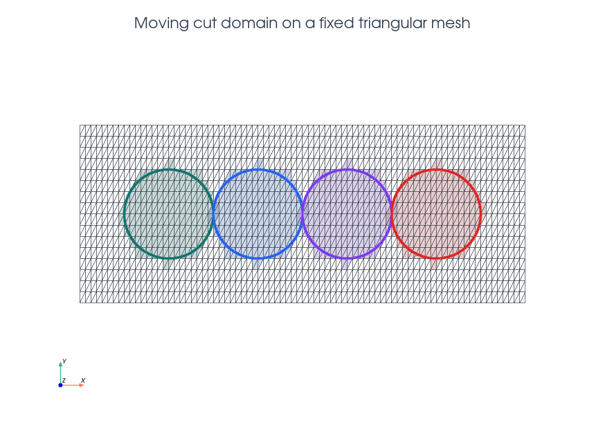
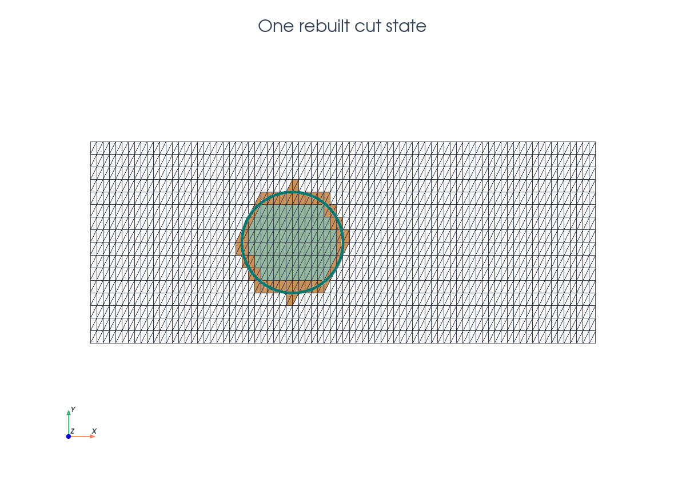
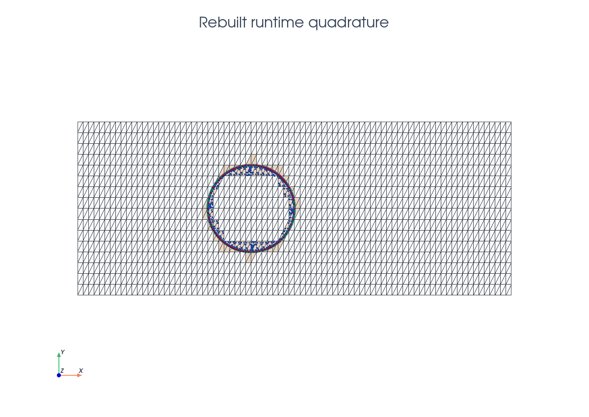
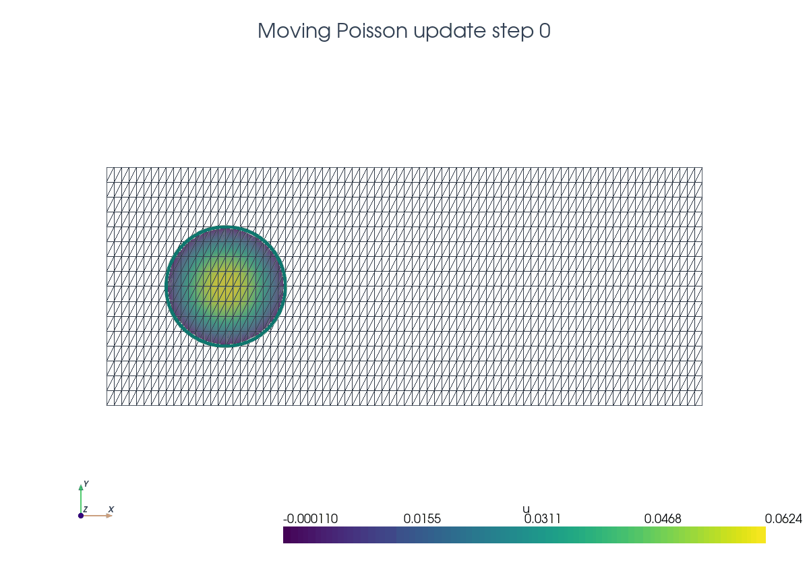

# Moving Poisson

This tutorial follows `python/demo/demo_moving_poisson.py`. The background
mesh and finite element space are fixed, while a circular level set moves
through the domain. The key point is that the `CutData` object is created once
for the reusable level-set function and then refreshed with
`cutfemx.update(cut_data)` after the level-set coefficients change. The entity
lists, runtime quadrature, ghost facets, assembled system, and cut-domain
output are then rebuilt from the updated cut state.
The update pattern is an implementation detail, while the underlying unfitted
moving-domain formulation is related to the CutFEM references in the related
literature below.

```{raw} html
<figure class="tutorial-figure">
  
  <figcaption>The same triangular background mesh is reused for all level-set positions.</figcaption>
</figure>
```

## Model Problem

At step $k$, the physical domain is the moving disk

$$
\Omega_k=\{x:\phi_k(x)<0\},\qquad
\phi_k(x,y)=\sqrt{(x-c_{k,0})^2+(y-c_{k,1})^2}-0.5 .
$$

The demo solves

$$
-\Delta u_k = 1 \quad \text{in }\Omega_k,
\qquad
u_k=0 \quad \text{on }\Gamma_k=\{\phi_k=0\},
$$

using symmetric Nitsche terms on the embedded boundary.

## Implementation Order

The demo has two implementation units. First, the top-level script creates the
fixed mesh, scalar space, reusable `phi` function, and initial `cut_data`
object. Then each loop iteration calls `solve_step(...)` followed by
`write_step_xdmf(...)`.

Inside `solve_step(...)` the order is:

1. Interpolate the moved circle level set into the existing `phi`.
2. Call `cutfemx.update(cut_data)` to refresh the existing cut state from the
   new `phi` coefficients.
3. Locate inside and cut cells, create runtime rules, and select ghost facets
   from the updated `cut_data`.
4. Build the Nitsche Poisson form with constant source `1` and homogeneous
   boundary value.
5. Assemble, deactivate inactive dofs from the CutFEMx form active domain, and
   solve.
6. Return the updated cut state, solution, and diagnostic entity lists to the
   loop.

`write_step_xdmf(...)` then writes the background fields and the physical cut
mesh for that same step.

## Fixed Mesh And Function Space

The mesh is created once on `[-1,4] x [-1,1]` with triangular cells. The
scalar finite element space is reused for every moving-domain solve.

```python
msh = mesh.create_rectangle(
    comm,
    ((-1.0, -1.0), (4.0, 1.0)),
    (5 * n, n),
    cell_type=mesh.CellType.triangle,
)
V = fem.functionspace(msh, ("Lagrange", 1))
phi = fem.Function(V, name="phi")
phi.interpolate(circle_level_set((0.0, 0.0), radius))
phi.x.scatter_forward()
cut_data = cutfemx.cut(phi)
```

The top-level loop then keeps passing that same `cut_data` object into
`solve_step(...)`. Inside `solve_step(...)`, the first operation after changing
`phi` is `cutfemx.update(cut_data)`, so the geometry is refreshed in place
before the current step is classified, assembled, solved, and written.

```python
for step in range(steps):
    center = (float(step), 0.0)
    cut_data, uh, inside_cells, cut_cells, ghost_facets = solve_step(
        msh,
        V,
        phi,
        cut_data,
        center,
        radius,
        order,
        gamma,
        gamma_g,
    )
    uh.name = f"u_h_{step:02d}"
    write_step_xdmf(output_dir, step, cut_data, phi, uh)
```

## Updating One Cut State

Only the level-set coefficients and the CutFEMx geometry state change from one
step to the next. The demo therefore keeps the same `phi` and `cut_data`
objects and updates their contents in place.

```{raw} html
<figure class="tutorial-figure">
  
  <figcaption>One time step after the level set has been interpolated and the active/cut cells have been classified.</figcaption>
</figure>
```

```python
phi.interpolate(circle_level_set(center, radius))
phi.x.scatter_forward()
cutfemx.update(cut_data)

inside_cells = cutfemx.locate_entities(cut_data, "phi<0")
cut_cells = cutfemx.locate_entities(cut_data, "phi=0")
```

`cutfemx.update(cut_data)` is the operation that makes the existing geometric
cut state follow the moved level set. The calls after it intentionally rebuild
the step-local classifications and quadrature data from that refreshed state.

## Rebuilding Quadrature And Facets

Each moved domain gets fresh runtime quadrature rules and a fresh ghost-facet
set. These objects are local to the current step.

```{raw} html
<figure class="tutorial-figure">
  
  <figcaption>Blue and magenta points are the physical quadrature points for one moved disk.</figcaption>
</figure>
```

```python
inside_rules = cutfemx.runtime_quadrature(cut_data, "phi<0", order)
interface_rules = cutfemx.runtime_quadrature(cut_data, "phi=0", order)
ghost_facets = cutfemx.ghost_penalty_facets(cut_data, "phi<0")
```

## Per-Step Solve Algorithm

The weak form is the same Nitsche formulation as the scalar Poisson tutorial,
but with a constant source and homogeneous boundary value.

## Output

The output is written per step. The animation below shows the same incremental
sequence: update the existing cut state, solve the current step, write that
step, and then move to the next level-set position.

```{raw} html
<figure class="tutorial-figure">
  <video class="tutorial-image" controls autoplay loop muted playsinline poster="../_static/tutorials/moving-poisson-update-sequence-poster.png">
    <source src="../_static/tutorials/moving-poisson-update-sequence.mp4" type="video/mp4">
    
  </video>
  <figcaption>The cut domain is solved and visualized one updated level-set position at a time.</figcaption>
</figure>
```

The script writes one background file and one cut-domain file per step in
`moving_poisson_xdmf/`.

## Related Literature

- E. Burman, S. Claus, P. Hansbo, M. G. Larson, and A. Massing,
  ["CutFEM: Discretizing Geometry and Partial Differential Equations"](https://doi.org/10.1002/nme.4823),
  *International Journal for Numerical Methods in Engineering* 104(7),
  472-501, 2015. This is the general CutFEM reference for fixed-background
  meshes, weak boundary imposition, and ghost stabilization.
- S. Claus, S. Bigot, and P. Kerfriden,
  ["CutFEM Method for Stefan--Signorini Problems with Application in Pulsed Laser Ablation"](https://doi.org/10.1137/18m1185697),
  *SIAM Journal on Scientific Computing* 40(5), B1444-B1469, 2018. This gives
  an example of CutFEM on moving level-set-defined domains without remeshing.

## Run The Demo

```bash
python python/demo/demo_moving_poisson.py
```

## Full Source

The complete source remains available in the repository:
[python/demo/demo_moving_poisson.py](../../python/demo/demo_moving_poisson.py).
