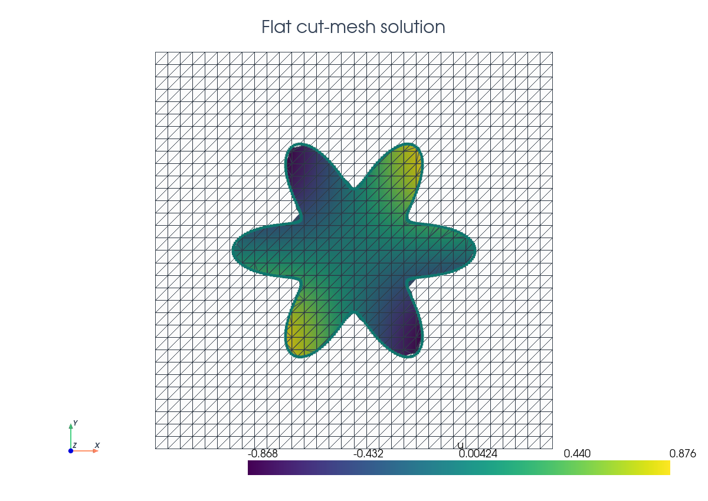
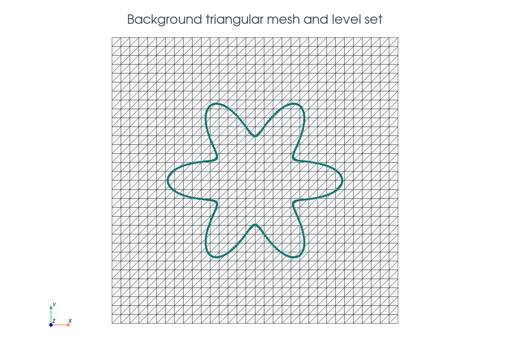
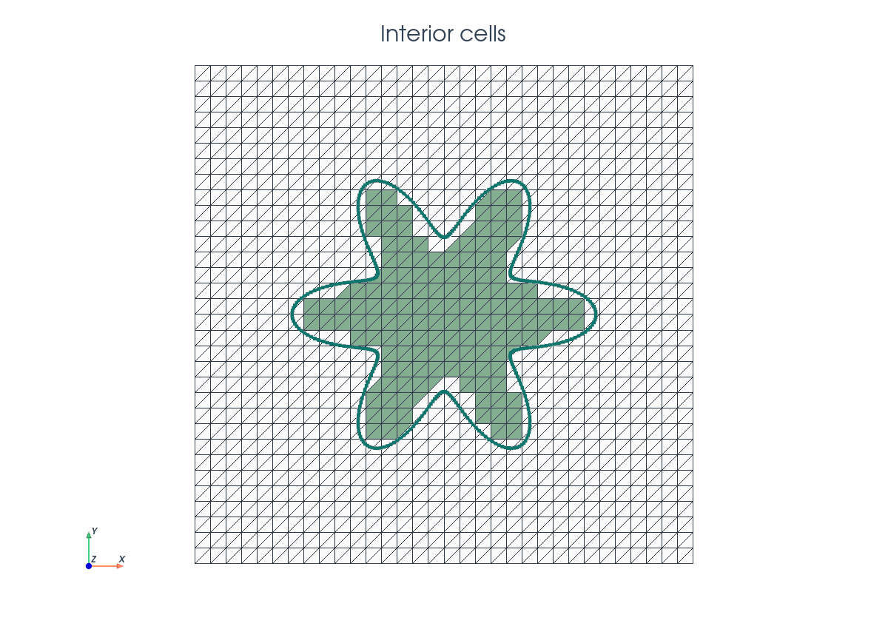
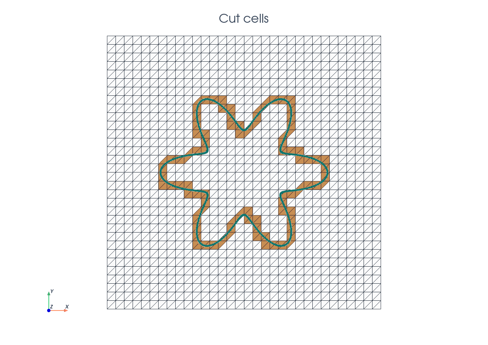
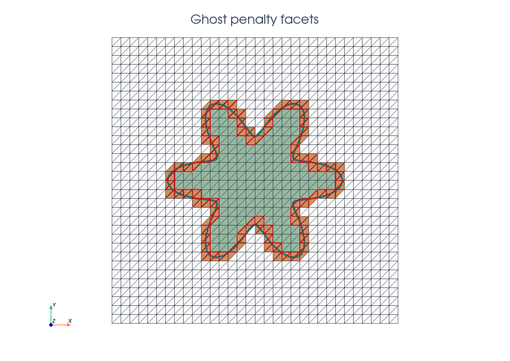

# Cut Poisson

This tutorial follows `python/demo/demo_poisson.py`. It shows how to set up a
Poisson problem inside a negative level set domain.
The Nitsche and ghost-penalty formulation follows the CutFEM framework
summarized in the related literature below.

```{raw} html
<figure class="tutorial-figure">
  
  <figcaption> Scalar solution on the physical cut mesh shown with the background triangular mesh.</figcaption>
</figure>
```

## Model Problem

Let $\Omega_0=[-1,1]^2$ be the background domain and let the physical domain be
the negative phase of a six-petal flower level set. With
$\rho=\sqrt{x^2+y^2}$ and $\theta=\operatorname{atan2}(y,x)$,

$$
r_\Gamma(\theta)=R_0+A\cos(m\theta),
\qquad
\phi(x,y)=\rho-r_\Gamma(\theta),
$$

where $R_0=0.46$, $A=0.15$, and $m=6$,

so that

$$
\Omega=\{(x,y)\in\Omega_0:\phi(x,y)<0\},
\qquad
\Gamma=\{(x,y)\in\Omega_0:\phi(x,y)=0\}.
$$

The demo solves the manufactured Dirichlet problem

$$
-\Delta u=f\quad\text{in }\Omega,\qquad u=g\quad\text{on }\Gamma,
$$

with

$$
u_\mathrm{ex}(x,y)=\sin(\pi x)\sin(\pi y),
\qquad f=2\pi^2u_\mathrm{ex},
\qquad g=u_\mathrm{ex}|_\Gamma .
$$

## Implementation Order

The script runs in this order:

1. Define the flower level set.
2. Build the triangular background mesh and interpolate the P1 level set.
3. Build `cut_data`, locate full inside cells, create volume/interface runtime
   quadrature, and select ghost-penalty facets.
4. Build the UFL measures, function space, Nitsche form, and ghost penalty.
5. Wrap the UFL forms with `cutfemx.fem.form`, assemble, deactivate inactive
   dofs using `cutfemx.fem.active_domain(a_form)`, and solve.
6. Interpolate exact/error fields, assemble the cut-domain $L^2$ error, print
   diagnostics, and write background plus cut-domain XDMF output.

## Imports

The script uses DOLFINx for the mesh and function spaces, UFL for the weak
form, and CutFEMx for cut classification, quadrature, normals, assembly, and
cut-mesh output.

```python
from pathlib import Path

from mpi4py import MPI

import cutfemx
import numpy as np
import ufl
from dolfinx import fem, io, la, mesh
```

## Background Mesh

The background mesh is deliberately not fitted to the flower boundary. It is the
computational mesh on which the level-set function, trial space, and
assembled linear system live.

```{raw} html
<figure class="tutorial-figure">
  
  <figcaption>The zero level set cuts through ordinary triangular cells of the background mesh.</figcaption>
</figure>
```

```python
comm = MPI.COMM_WORLD
n = 32

msh = mesh.create_rectangle(
    comm,
    ((-1.0, -1.0), (1.0, 1.0)),
    (n, n),
    cell_type=mesh.CellType.triangle,
)
```

## Level Set Function

The implicit geometry is represented by a standard finite element function.
CutFEMx reads the level set finite element function and computes the intersection of the level set with the background mesh with `cutfemx.cut`. In this example, we use a linear level-set function in a triangular background mesh. 

```python
base_radius = 0.46
amplitude = 0.15
petals = 6
V_phi = fem.functionspace(msh, ("Lagrange", 1))
phi = fem.Function(V_phi, name="phi")

phi.interpolate(flower_level_set(base_radius, amplitude, petals))
phi.x.scatter_forward()
```

## Interior Cells

Cells fully inside the negative phase use ordinary cell integration. These are
the cells selected by the `"phi<0"` predicate.

```{raw} html
<figure class="tutorial-figure">
  
  <figcaption>Interior cells contribute with the usual DOLFINx cell quadrature.</figcaption>
</figure>
```

```python
cut_data = cutfemx.cut(phi)
inside_cells = cutfemx.locate_entities(cut_data, "phi<0")
```

## Runtime Quadrature

Cells intersected by $\Gamma$ need to be integrated differently. The function `runtime_quadrature` generates runtime quadrature rules depending on how the level set intersects the cells. For the Poisson problem we need the parts of cells that intersect with the physical domain, i.e. $K\cap\Omega$ , and interface rules $K\cap\Gamma$.

```{raw} html
<figure class="tutorial-figure">
  
  <figcaption>Cut cells with partial volume integrals on $\Omega$ and interface integrals on $\Gamma$.</figcaption>
</figure>
```

```python
order = 4
volume_rules = cutfemx.runtime_quadrature(cut_data, "phi<0", order)
interface_rules = cutfemx.runtime_quadrature(cut_data, "phi=0", order)
```

```{raw} html
<figure class="tutorial-figure">
  <iframe class="tutorial-frame" src="../_static/tutorials/poisson-quadrature-view.html" title="Interactive Poisson quadrature view" loading="lazy" allowfullscreen></iframe>
  <figcaption>Blue points indicate cut-volume quadrature; magenta points indicate embedded-boundary quadrature.</figcaption>
</figure>
```

The standard cells and runtime rules are combined in UFL measures:

```python
dx_omega = ufl.Measure(
    "dx", domain=msh, subdomain_id=0, subdomain_data=[inside_cells, volume_rules]
)
dx_gamma = ufl.Measure("dx", domain=msh, subdomain_id=1, subdomain_data=interface_rules)
```

Each integration measure needs a different `subdomain_id`. 

## Finite Element Space

The unknown is still a standard continuous Lagrange function on the background
mesh. The restriction to $\Omega$ is encoded by the measures and by degree-of-freedom deactivation after assembly.

```python
V = fem.functionspace(msh, ("Lagrange", 1))
u = ufl.TrialFunction(V)
v = ufl.TestFunction(V)
x = ufl.SpatialCoordinate(msh)

u_exact = ufl.sin(np.pi * x[0]) * ufl.sin(np.pi * x[1])
f = 2.0 * np.pi**2 * u_exact
```

## Nitsche Boundary Terms

The embedded boundary does not coincide with mesh facets. Therefore, we enforce Dirichlet conditions weakly using Nitsche's method. For Nitsche's method, we need the outside normal to the interface, which can be computed in CutFEMx from the level set function with `cutfemx.normal(phi)`. The weak formulation, we want to implement is 

\[a(u, v)
= \int_{\Omega} \nabla u \cdot \nabla v \, dx
+ \int_{\Gamma}
\left(
- (\nabla u \cdot n_{\Gamma}) v
- (\nabla v \cdot n_{\Gamma}) u
+ \frac{\gamma}{h} u v
\right) \, ds
\] 

\[L(v)
= \int_{\Omega} f v \, dx
+ \int_{\Gamma}
\left(
- (\nabla v \cdot n_{\Gamma}) u_{\mathrm{exact}}
+ \frac{\gamma}{h} u_{\mathrm{exact}} v
\right) \, ds
\]

```python
n_gamma = cutfemx.normal(phi)
h = ufl.CellDiameter(msh)
gamma = 40.0

a = ufl.inner(ufl.grad(u), ufl.grad(v)) * dx_omega
a += (
    -ufl.dot(ufl.grad(u), n_gamma) * v
    - ufl.dot(ufl.grad(v), n_gamma) * u
    + gamma / h * u * v
) * dx_gamma

L = f * v * dx_omega
L += (-ufl.dot(ufl.grad(v), n_gamma) * u_exact + gamma / h * u_exact * v) * dx_gamma
```

## Ghost Penalty Facets

Small cuts can make the unstabilized stiffness matrix ill-conditioned. Here, we use ghost penalty stabilization, which adds gradient jump penalties to intersected edges and edges that connect intersected elements to the interior.  


```{raw} html
<figure class="tutorial-figure">
  
  <figcaption>Red facets mark the ghost-penalty band coupling cut cells to neighboring active cells.</figcaption>
</figure>
```

The ghost penalty terms are 


\[a(u, v) \mathrel{+}=
\int_{\mathcal{F}_{\mathrm{ghost}}}
\gamma_g h_{\mathrm{avg}}
\llbracket \nabla u \cdot n_F \rrbracket
\llbracket \nabla v \cdot n_F \rrbracket
\, dS
\] 

which are implemented as 

```python
ghost_facets = cutfemx.ghost_penalty_facets(cut_data, "phi<0")
dS_ghost = ufl.Measure("dS", domain=msh, subdomain_id=2, subdomain_data=ghost_facets)

n_facet = ufl.FacetNormal(msh)
h_avg = ufl.avg(h)
gamma_g = 0.1

a += gamma_g * h_avg * ufl.inner( ufl.jump(ufl.grad(u), n_facet), ufl.jump(ufl.grad(v), n_facet),)* dS_ghost

```

## Assembly And Solve

The UFL forms are compiled as CutFEMx runtime forms. After assembly, inactive
background rows are replaced by identity rows so the serial sparse system has a
well-defined value on every background degree of freedom.

```python
a_form = cutfemx.fem.form(a)
L_form = cutfemx.fem.form(L)

A = cutfemx.fem.assemble_matrix(a_form)
A.scatter_reverse()
b = cutfemx.fem.assemble_vector(L_form)
b.scatter_reverse(la.InsertMode.add)
cutfemx.fem.deactivate_outside(A, b, cutfemx.fem.active_domain(a_form))
```

We solve the serial `MatrixCSR` system with SciPy:

```python
from scipy.sparse.linalg import spsolve

uh = fem.Function(V, name="u_h")
uh.x.array[:] = spsolve(A.to_scipy().tocsr(), b.array)
uh.x.scatter_forward()
```

Then we compute the exact background function and the cut-domain error
with the same `dx_omega` measure used for the solve:

```python
u_exact_bg = fem.Function(V, name="u_exact")
u_exact_bg.interpolate(lambda x: np.sin(np.pi * x[0]) * np.sin(np.pi * x[1]))
u_exact_bg.x.scatter_forward()

error_bg = fem.Function(V, name="u_error")
error_bg.x.array[:] = uh.x.array - u_exact_bg.x.array
error_bg.x.scatter_forward()

error_form = cutfemx.fem.form((uh - u_exact) ** 2 * dx_omega)
error_sq = comm.allreduce(cutfemx.fem.assemble_scalar(error_form), op=MPI.SUM)
```

## Solution Output

The solution is written both on the background mesh and on a visualization
cut mesh. The cut mesh is not used for assembly; it is only a convenient output
mesh for inspecting the physical domain.

```{raw} html
<figure class="tutorial-figure">
  <iframe class="tutorial-frame" src="../_static/tutorials/poisson-solution-view.html" title="Interactive warped Poisson solution view" loading="lazy" allowfullscreen></iframe>
  <figcaption> Solution to Poisson problem on the flower-shaped cut mesh.</figcaption>
</figure>
```

```python
cut_mesh = cutfemx.create_cut_mesh(cut_data, "phi<0", mode="full")
uh_cut = cutfemx.fem.cut_function(uh, cut_mesh)
```

The script writes:

- `poisson_xdmf/poisson_background.xdmf`
- `poisson_xdmf/poisson_cut_domain.xdmf`

## Related Literature

- E. Burman, S. Claus, P. Hansbo, M. G. Larson, and A. Massing,
  ["CutFEM: Discretizing Geometry and Partial Differential Equations"](https://doi.org/10.1002/nme.4823),
  *International Journal for Numerical Methods in Engineering* 104(7),
  472-501, 2015. This is the main CutFEM reference for the unfitted
  Nitsche formulation and ghost stabilization used in this example.
- E. Burman,
  ["Ghost Penalty"](https://doi.org/10.1016/j.crma.2010.10.006),
  *Comptes Rendus Mathematique* 348(21-22), 1217-1220, 2010. This is the
  original short reference for the ghost-penalty stabilization used to keep
  cut-cell systems well conditioned.
- A. Hansbo and P. Hansbo,
  ["An unfitted finite element method, based on Nitsche's method, for elliptic interface problems"](https://doi.org/10.1016/S0045-7825(02)00524-8),
  *Computer Methods in Applied Mechanics and Engineering* 191(47-48),
  5537-5552, 2002. This is a classical unfitted Nitsche reference behind the
  weak boundary and interface treatment used in CutFEM formulations.

## Run The Demo

```bash
python python/demo/demo_poisson.py
```

## Full Source

The complete source remains available in the repository:
[python/demo/demo_poisson.py](../../python/demo/demo_poisson.py).
