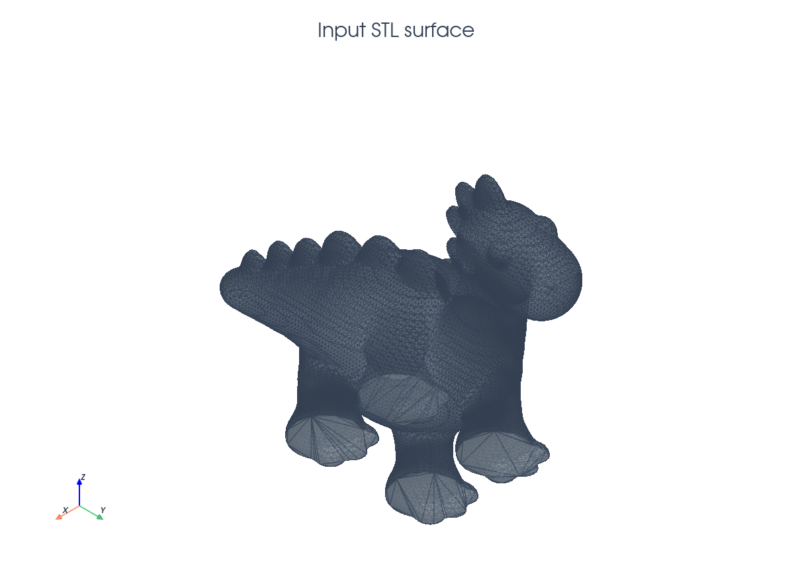
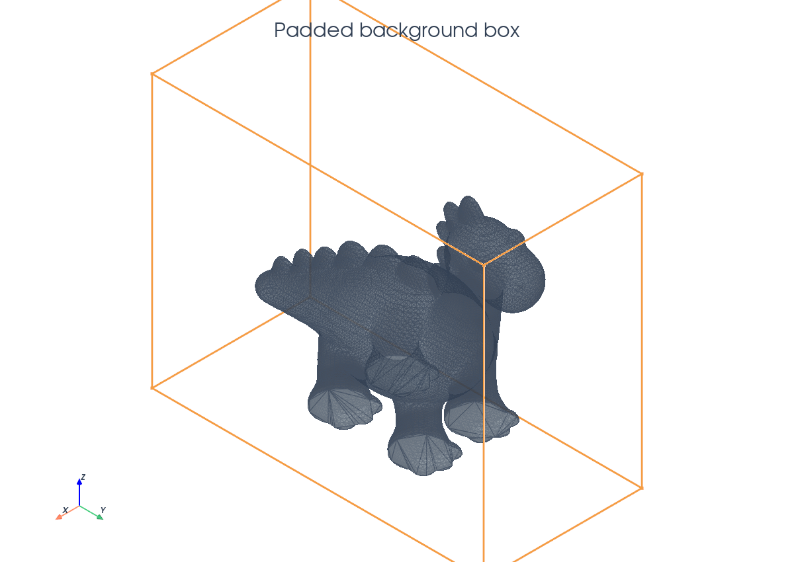
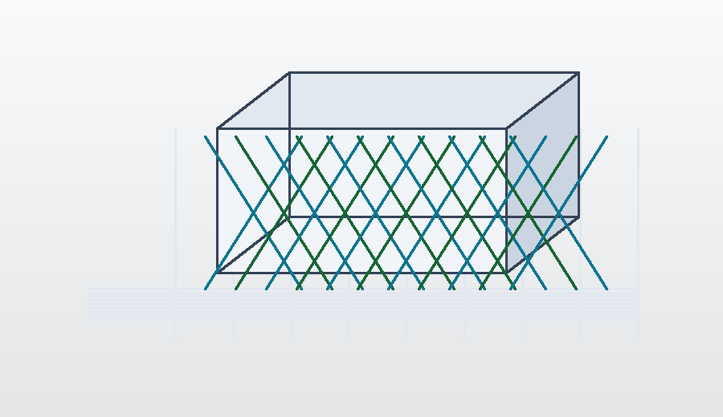

# STL Distance

This tutorial follows `python/demo/demo_stl_distance.py`. It is a geometry
preprocessing workflow rather than a variational solve: an STL surface is
converted into a signed distance field on a background mesh, producing the
level-set input used by the cut-integration demos.

```{raw} html
<figure class="tutorial-figure">
  
  <figcaption>The input is the actual triangulated STL surface used by the demo.</figcaption>
</figure>
```

## Implementation Order

The demo is a preprocessing script, so its execution order is:

1. Resolve `python/demo/Dino.stl` and read its bounding box on rank 0.
2. Broadcast the STL bounds and build a padded tetrahedral background box.
3. Refine that mesh around the STL triangles with `adapt_mesh_to_stl`.
4. Compute `dist = from_stl(refined_mesh, stl_path, sign_mode=...)`.
5. Report the signed-distance range and number of negative dofs.
6. Write `distance_from_stl.xdmf`.

It does not assemble a PDE and it does not call `cutfemx.cut`. The output
function `dist` is the level-set input that later cut-integration demos can
pass to `cutfemx.cut`.

## From Surface Mesh To Level Set

Given a triangulated surface $\Sigma$, the signed distance field is

$$
\phi(x)=s(x)\operatorname{dist}(x,\Sigma),
\qquad
\operatorname{dist}(x,\Sigma)=\inf_{y\in\Sigma}|x-y|.
$$

The actual demo computes this field and writes it; cut classification and
runtime quadrature happen in later demos that consume the field:

```python
from cutfemx.distance import SignMode, from_stl

dist = from_stl(refined_mesh, stl_path, sign_mode=SignMode.ComponentAnchor)
```

## Background Box

The demo reads the STL bounding box, pads it, and creates a tetrahedral
background mesh around the surface.

```{raw} html
<figure class="tutorial-figure">
  
  <figcaption>The orange box indicates the padded background domain used before local refinement.</figcaption>
</figure>
```

```python
from cutfemx.distance import compute_stl_bbox

if rank == 0:
    min_c, max_c = compute_stl_bbox(stl_path)
    min_pt_stl[:] = min_c
    max_pt_stl[:] = max_c

comm.Bcast(min_pt_stl, root=0)
comm.Bcast(max_pt_stl, root=0)

min_pt_mesh = min_pt_stl - padding
max_pt_mesh = max_pt_stl + padding

msh = create_box(
    comm,
    [min_pt_mesh, max_pt_mesh],
    N_mesh,
    CellType.tetrahedron,
    ghost_mode=GhostMode.shared_facet,
)
```

The padding ensures the resulting field contains a neighbourhood on both sides
of the STL surface, which is what later cut quadrature and ghost-facet
construction need.

## Adapt Around The Surface

Before computing the distance, the mesh is refined around the STL triangles:

```{raw} html
<figure class="tutorial-figure">
  
  <figcaption>The adapted tetrahedral background mesh is refined around the actual STL surface; the middle slice exposes the smaller cells near the geometry.</figcaption>
</figure>
```

```python
refined_mesh = adapt_mesh_to_stl(
    msh,
    stl_path,
    nlevels=3,
    k_ring=1,
    aabb_padding=0.0,
    ghost_mode=GhostMode.shared_facet,
)
```

The refinement is geometric. Cells near the surface and a small ring of
neighbours are refined, concentrating resolution where the zero level set and
near-field distance are most important.

## Signed Distance Field

The signed field is computed with the distance module:

```{raw} html
<figure class="tutorial-figure">
  
  <figcaption>A middle y-z slice through the computed signed-distance field shows filled values and contour lines; the highlighted contour marks the zero level set.</figcaption>
</figure>
```

```python
dist = from_stl(refined_mesh, stl_path, sign_mode=SignMode.ComponentAnchor)
```

`SignMode.ComponentAnchor` assigns signs by treating the surface as a barrier
between mesh components. This is a practical choice for triangulated geometry
where local triangle normals may not give a reliable global inside/outside
classification.

## Diagnostics And Output

The demo checks the global value range and counts negative degrees of freedom:

```python
global_min = comm.allreduce(local_min, op=MPI.MIN)
global_max = comm.allreduce(local_max, op=MPI.MAX)
global_neg = comm.allreduce(local_neg, op=MPI.SUM)
```

Then it writes the refined mesh and distance field:

```python
with XDMFFile(comm, "distance_from_stl.xdmf", "w") as xdmf:
    xdmf.write_mesh(refined_mesh)
    xdmf.write_function(dist)
```

The zero isosurface of `dist` should recover the STL surface, while the signs
define the two phases available to later CutFEMx computations.

## Run The Demo

```bash
python python/demo/demo_stl_distance.py
```

## Full Source

The complete source remains available in the repository:
[python/demo/demo_stl_distance.py](../../python/demo/demo_stl_distance.py).
