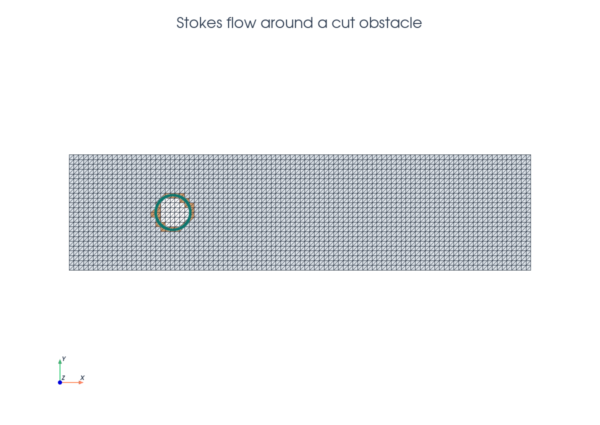
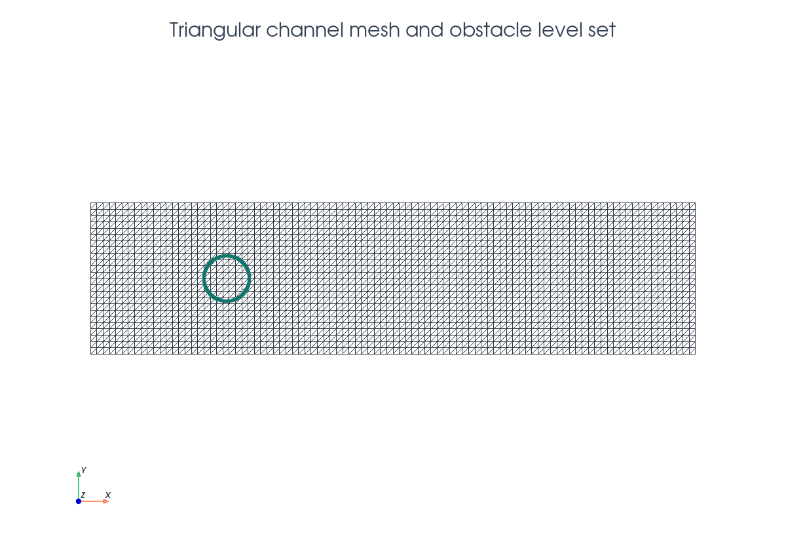
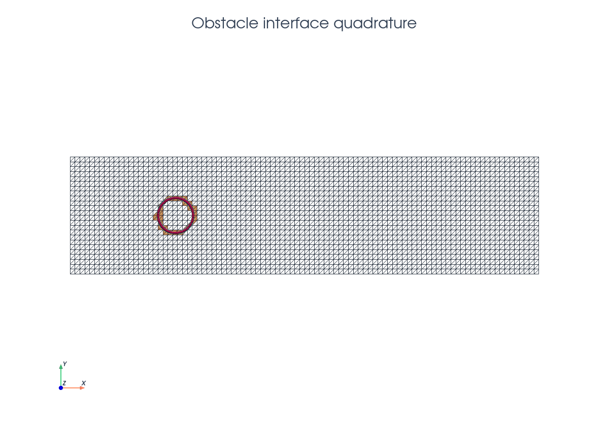
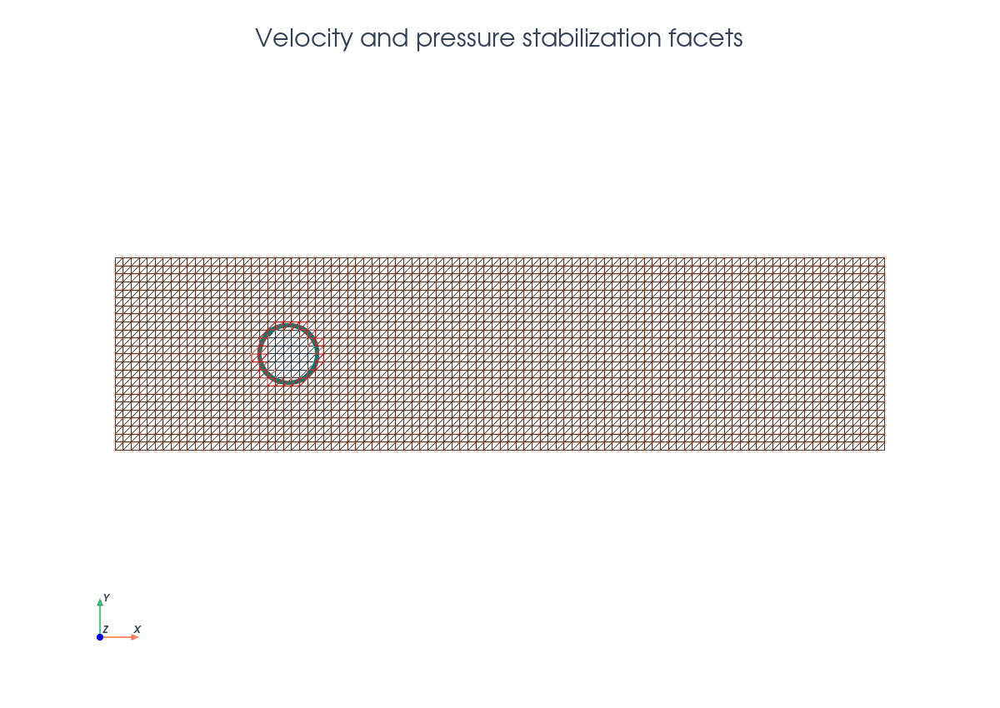
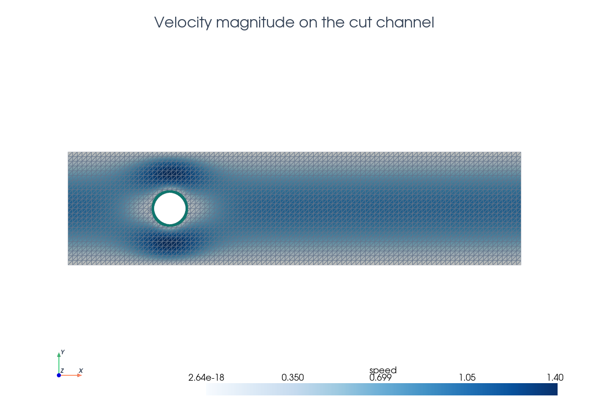

# Stokes Flow

This tutorial follows `python/demo/demo_stokes.py`. It solves a steady channel
Stokes problem with an unfitted circular obstacle. The inflow, walls, and
outflow are fitted boundary facets of the rectangular mesh, while the obstacle
boundary is represented by a level set and imposed weakly.
The Nitsche fictitious-domain Stokes terms and the velocity/pressure
stabilization are tied to the references listed in the related literature
below.

```{raw} html
<figure class="tutorial-figure">
  
  <figcaption>The obstacle is placed closer to the inflow; orange cells are cut by the embedded circle.</figcaption>
</figure>
```

## Model Problem

The fluid domain is

$$
\Omega=\{(x,y)\in[-3,5]\times[-1,1]:\phi(x,y)>0\},
\qquad
\phi(x,y)=\sqrt{(x+1.2)^2+y^2}-0.3 .
$$

The demo uses the gradient form of the steady Stokes equations,

$$
-\nu\Delta u+\nabla p=0,\qquad \nabla\cdot u=0
\quad\text{in }\Omega .
$$

The fitted channel boundaries carry standard flow boundary conditions:

$$
u=(1-y^2,0)\quad\text{on }x=-3,\qquad
u=0\quad\text{on }y=\pm1 .
$$

The circular obstacle has $u=0$ on $\Gamma=\{\phi=0\}$, imposed by Nitsche
terms. The outflow at $x=5$ is left as the natural boundary of the weak form,

$$
(\nu\nabla u-pI)n=0 .
$$

This is the open-boundary condition whose viscous part is
$\nabla u\,n$.

## Implementation Order

The demo executes the solve in this order:

1. Define the positive-in-fluid cylinder level set, gradient-form traction,
   serial solve helper, and XDMF writer.
2. Build the triangular channel mesh and equal-order mixed P1/P1 space.
3. Interpolate the pressure-space level set and cut the fluid domain.
4. Locate fluid/cut cells, build fluid/interface rules, ghost facets, and the
   active pressure-stabilization skeleton.
5. Build `dx_omega`, `dx_gamma`, `dS_ghost`, and `dS_pressure`.
6. Assemble the Stokes volume terms, obstacle Nitsche terms, velocity ghost
   penalty, and pressure gradient-jump stabilization.
7. Build fitted inflow/wall velocity boundary conditions, assemble with BCs,
   apply lifting, deactivate inactive dofs, and solve.
8. Split velocity/pressure, interpolate velocity for XDMF compatibility, print
   diagnostics, and write background plus cut-fluid XDMF files.

## Triangular Channel Mesh

The mesh is created exactly as in the demo: a rectangle with `4*n` cells in
the streamwise direction and `n` cells across the channel, using triangular
cells.

```{raw} html
<figure class="tutorial-figure">
  
  <figcaption>The obstacle cuts through the triangular channel mesh; no fitted circular boundary is inserted.</figcaption>
</figure>
```

```python
msh = mesh.create_rectangle(
    comm,
    ((-3.0, -1.0), (5.0, 1.0)),
    (4 * n, n),
    cell_type=mesh.CellType.triangle,
)
```

The velocity and pressure are both continuous P1 fields. The equal-order pair
is stabilized by a pressure gradient-jump term on the active skeleton.

```python
P1 = basix.ufl.element("Lagrange", msh.basix_cell(), 1)
P1_vec = basix.ufl.element(
    "Lagrange", msh.basix_cell(), 1, shape=(msh.geometry.dim,)
)
W = fem.functionspace(msh, basix.ufl.mixed_element([P1_vec, P1]))
```

## Cut Fluid Domain

The positive phase is the fluid. Cut cells are handled separately because they
need partial-volume and interface quadrature.

```python
cylinder_center = (-1.2, 0.0)
cylinder_radius = 0.3

level_set = fem.Function(Q, name="phi")
level_set.interpolate(cylinder_level_set(cylinder_center, cylinder_radius))
level_set.x.scatter_forward()

cut_data = cutfemx.cut(level_set)
fluid_cells = cutfemx.locate_entities(cut_data, "phi>0")
cut_cells = cutfemx.locate_entities(cut_data, "phi=0")
uncut_fluid_cells = np.setdiff1d(fluid_cells, cut_cells)
```

## Interface Quadrature And Nitsche Terms

The obstacle boundary is not part of the mesh topology. CutFEMx supplies
physical quadrature points on the embedded circle, and the normal is computed
from the level set.

```{raw} html
<figure class="tutorial-figure">
  
  <figcaption>Magenta markers are the actual interface quadrature points used for obstacle Nitsche terms.</figcaption>
</figure>
```

```python
fluid_rules = cutfemx.runtime_quadrature(cut_data, "phi>0", order)
interface_rules = cutfemx.runtime_quadrature(cut_data, "phi=0", order)

dx_omega = ufl.Measure(
    "dx", domain=msh, subdomain_id=0, subdomain_data=[uncut_fluid_cells, fluid_rules]
)
dx_gamma = ufl.Measure("dx", domain=msh, subdomain_id=1, subdomain_data=interface_rules)
n_gamma = -cutfemx.normal(level_set)
```

## Weak Formulation

Let $V_h$ be the continuous P1 velocity space and $Q_h$ the continuous P1
pressure space on the background mesh. Strong Dirichlet data are applied on the
fitted inflow and wall facets, so the remaining test functions vanish there.
The outflow is natural: no boundary integral is added at $x=5$, and the weak
form therefore enforces $(\nu\nabla u-pI)n=0$ there.

The cut-domain volume contribution is the standard mixed Stokes form:

$$
a_\Omega((u,p),(v,q))
=\int_\Omega \nu\nabla u:\nabla v\,dx
-\int_\Omega p\,\nabla\cdot v\,dx
+\int_\Omega (\nabla\cdot u)q\,dx .
$$

In code this is the first block of the bilinear form:

```python
a = nu * ufl.inner(ufl.grad(u), ufl.grad(v)) * dx_omega
a += -p * ufl.div(v) * dx_omega
a += ufl.div(u) * q * dx_omega
```

The weak obstacle terms use the gradient-form Stokes traction
$t(u,p)=(\nu\nabla u-pI)n_\Gamma$ and impose $u=0$ on
$\Gamma=\{\phi=0\}$ by symmetric Nitsche terms:

$$
N_\Gamma((u,p),(v,q))
=-\int_\Gamma t(u,p)\cdot v\,d\Gamma
-\int_\Gamma t(v,q)\cdot u\,d\Gamma
+\int_\Gamma \frac{\gamma_u\nu}{h}u\cdot v\,d\Gamma .
$$

The three Nitsche terms have distinct roles: the first is the consistency
traction from integration by parts, the second is the adjoint-consistency term,
and the third is the penalty that weakly enforces no-slip on the embedded
circle.

```python
def traction(u, p, nu, n):
    return nu * ufl.dot(ufl.grad(u), n) - p * n


a += -ufl.inner(traction(u, p, nu, n_gamma), v) * dx_gamma
a += -ufl.inner(traction(v, q, nu, n_gamma), u) * dx_gamma
a += gamma_u * nu / h * ufl.inner(u, v) * dx_gamma
```

The right-hand side is zero in this example,

$$
L(v,q)=\int_\Omega f\cdot v\,dx,\qquad f=(0,0),
$$

because the flow is driven by the strong parabolic inflow condition.

## Stabilization Facets

The demo uses different facet sets for pressure and velocity stabilization.
This separation matters: equal-order pressure stability is a global active
skeleton requirement, while velocity stabilization is only needed to control
small cut-cell extensions near the unfitted obstacle.

```{raw} html
<figure class="tutorial-figure">
  
  <figcaption>Red facets are the velocity ghost-penalty band; faint orange facets are all active interior facets used by pressure stabilization.</figcaption>
</figure>
```

```python
ghost_facets = cutfemx.ghost_penalty_facets(cut_data, "phi>0")
active_cells = np.union1d(fluid_cells, cut_cells)
pressure_facets = cutfemx.interior_facets_for_cells(msh, active_cells)

dS_ghost = ufl.Measure("dS", domain=msh, subdomain_id=2, subdomain_data=ghost_facets)
dS_pressure = ufl.Measure("dS", domain=msh, subdomain_id=3, subdomain_data=pressure_facets)
```

### Pressure Stabilization

The P1/P1 pair does not satisfy the inf-sup condition without additional
stabilization. The demo therefore adds a pressure gradient-jump term on all
active interior facets,

$$
\mathcal F_h^\Omega=\texttt{interior\_facets\_for\_cells(active\_cells)} .
$$

The term is

$$
S_p(p,q)=
\gamma_p\int_{\mathcal F_h^\Omega}
h^3[\nabla p]n\cdot[\nabla q]n\,dS .
$$

In the implementation this is the `dS_pressure` contribution and is assembled
whether or not a facet lies in the cut band:

```python
a += (
    gamma_p
    * ufl.avg(h) ** 3
    * ufl.inner(
        ufl.jump(ufl.grad(p), n_facet),
        ufl.jump(ufl.grad(q), n_facet),
    )
    * dS_pressure
)
```

### Velocity Ghost Penalty

Velocity does not receive a gradient-jump term on the full active skeleton.
Instead, it is stabilized only on the ghost-penalty band
$\mathcal F_g$ returned by `ghost_penalty_facets(cut_data, "phi>0")`. This
band couples cut cells to neighboring fluid cells and controls conditioning
when the circle leaves very small intersections.

$$
S_u(u,v)=
\gamma_g\int_{\mathcal F_g}
h[\nabla u]n\cdot[\nabla v]n\,dS .
$$

The code deliberately uses `dS_ghost`, not `dS_pressure`, for this term:

```python
if ghost_facets.size > 0:
    a += (
        gamma_g
        * ufl.avg(h)
        * ufl.inner(
            ufl.jump(ufl.grad(u), n_facet),
            ufl.jump(ufl.grad(v), n_facet),
        )
        * dS_ghost
    )
```

The full bilinear form is therefore

$$
A((u,p),(v,q))
=a_\Omega((u,p),(v,q))
+N_\Gamma((u,p),(v,q))
+S_p(p,q)
+S_u(u,v).
$$

## Boundary Conditions And Output

The only strong boundary conditions are velocity conditions on the fitted
inflow and channel walls. The outflow has no pressure Dirichlet dofs; its
condition is the natural traction boundary described above. After solving,
CutFEMx writes both background and cut-fluid XDMF files.

```python
inflow_u = fem.Function(V)
inflow_u.interpolate(lambda x: np.stack((1.0 - x[1] ** 2, np.zeros_like(x[0]))))
walls_u = fem.Function(V)
walls_u.x.array[:] = 0.0

inflow_facets = mesh.locate_entities_boundary(
    msh, facet_dim, lambda x: np.isclose(x[0], -3.0)
)
wall_facets = mesh.locate_entities_boundary(
    msh, facet_dim, lambda x: np.isclose(np.abs(x[1]), 1.0)
)
inflow_dofs = fem.locate_dofs_topological((W.sub(0), V), facet_dim, inflow_facets)
wall_dofs = fem.locate_dofs_topological((W.sub(0), V), facet_dim, wall_facets)

bcs = [
    fem.dirichletbc(inflow_u, inflow_dofs, W.sub(0)),
    fem.dirichletbc(walls_u, wall_dofs, W.sub(0)),
]
```

```{raw} html
<figure class="tutorial-figure">
  
  <figcaption>The final view color-maps a velocity-magnitude field on the cut-fluid mesh.</figcaption>
</figure>
```

The script writes velocity and pressure fields in `stokes_xdmf/`.

## Related Literature

- A. Massing, M. G. Larson, A. Logg, and M. E. Rognes,
  ["A Stabilized Nitsche Fictitious Domain Method for the Stokes Problem"](https://doi.org/10.1007/s10915-014-9838-9),
  *Journal of Scientific Computing* 61(3), 604-628, 2014. This is a core
  reference for unfitted Stokes discretizations with Nitsche boundary
  conditions, pressure stabilization, and ghost penalties.
- E. Burman, S. Claus, and A. Massing,
  ["A Stabilized Cut Finite Element Method for the Three Field Stokes Problem"](https://doi.org/10.1137/140983574),
  *SIAM Journal on Scientific Computing* 37(4), A1705-A1726, 2015. This gives
  closely related CutFEM Stokes analysis with equal-order background fields,
  weak boundary imposition, and CIP/ghost-type stabilization.

## Run The Demo

```bash
python python/demo/demo_stokes.py
```

## Full Source

The complete source remains available in the repository:
[python/demo/demo_stokes.py](../../python/demo/demo_stokes.py).
