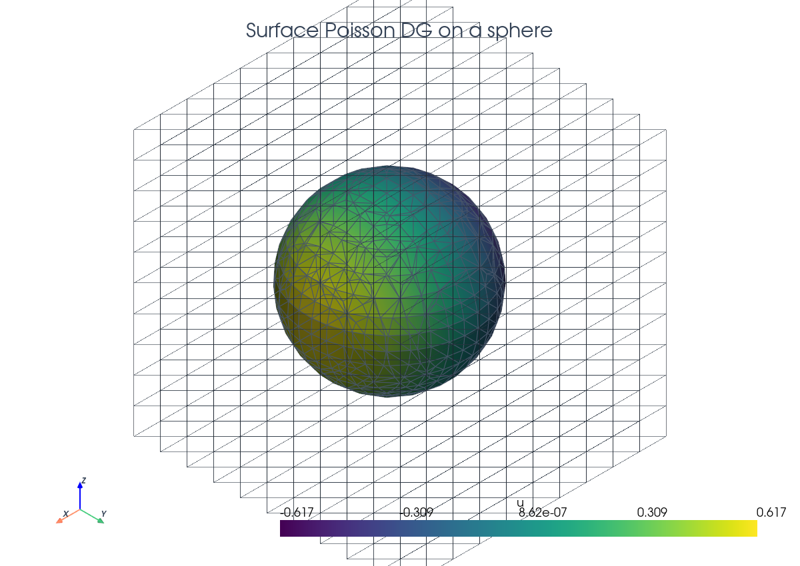
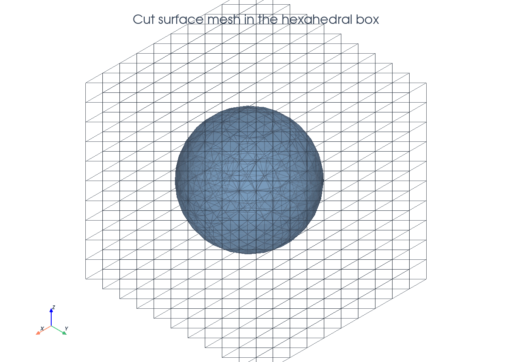
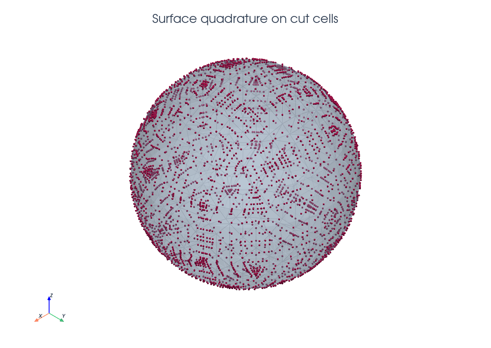
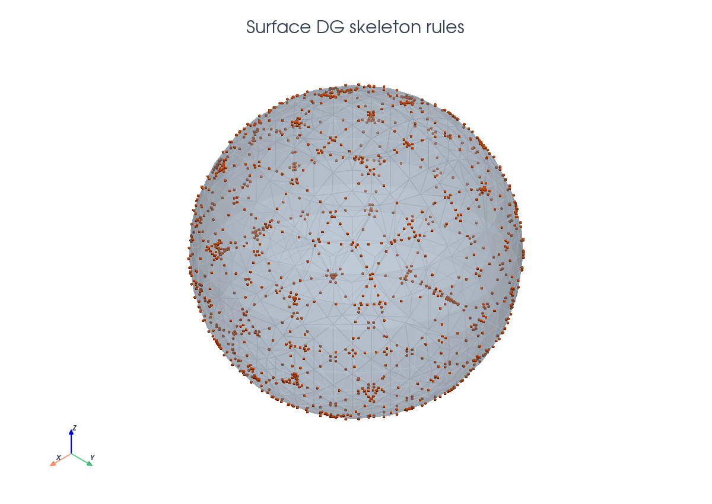
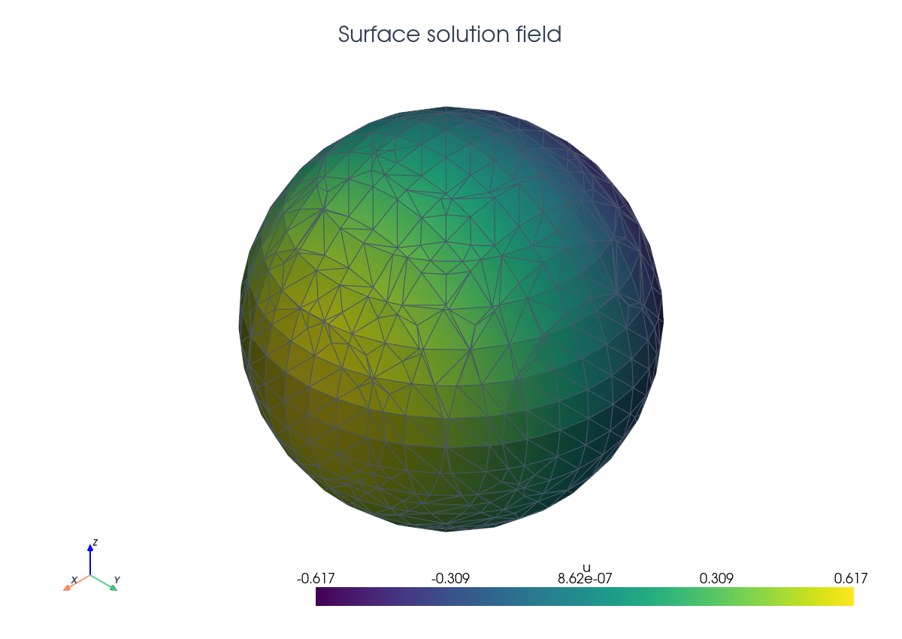

# Surface Poisson DG

This tutorial follows `python/demo/demo_surface_poisson_dg.py`. The unknown is
defined on an embedded surface rather than in one phase of a cut volume. The
demo uses a hexahedral background mesh and builds the surface mesh from
CutFEMx's `"phi=0"` cut geometry.
The surface CutFEM and cut DG ingredients are related to the references in the
related literature below.

```{raw} html
<figure class="tutorial-figure">
  
  <figcaption>The CutFEMx surface mesh is extracted from the zero level set inside the hexahedral background mesh.</figcaption>
</figure>
```

## Model Problem

Let $\Gamma=\{x:\phi(x)=0\}$ be a sphere of radius $R=0.62$ centered at
$c=(0.05,-0.03,0.02)$. The demo solves

$$
-\Delta_\Gamma u + u = f \quad \text{on }\Gamma,
$$

with manufactured solution $u_\mathrm{ex}=x_0-c_0$. On the sphere this gives

$$
f=\left(1+\frac{2}{R^2}\right)(x_0-c_0).
$$

## Implementation Order

The demo executes the surface solve in this order:

1. Define the level set function.
2. Build the hexahedral background mesh and interpolate a quadratic level set.
3. Cut cells with `"phi=0"` and create Algoim surface quadrature.
4. Build the active surface skeleton by cutting interior facets adjacent to
   the cut cells; use those same surface skeleton facets as the ghost set.
5. Build `dx_gamma`, `dS_gamma`, and `dS_ghost`.
6. Build the DG space, tangential gradients, conormal jumps, SIPG terms, and
   ghost stabilization.
7. Assemble, deactivate inactive dofs, solve, compute exact/error fields and
   the surface measure, then write background, XDMF preview, and DG VTK output.

## Background Mesh And Cut Surface

The level set is interpolated into a quadratic Lagrange space on the
background hexahedral mesh. Cells intersected by the zero level set are found
with the `"phi=0"` predicate.

```{raw} html
<figure class="tutorial-figure">
  
  <figcaption>The visible surface is the generated cut mesh, not an analytic sphere. The cut mesh is used only for visualisation. Quadrature rules are generated on the quadratic level set surface. </figcaption>
</figure>
```

```python
msh = mesh.create_box(
    comm,
    (np.array([-1.0, -1.0, -1.0]), np.array([1.0, 1.0, 1.0])),
    (n, n, n),
    cell_type=mesh.CellType.hexahedron,
)

V_phi = fem.functionspace(msh, ("Lagrange", 2))
phi = fem.Function(V_phi, name="phi")
phi.interpolate(lambda x: squared_distance(x, center) - radius**2)
phi.x.scatter_forward()

cell_cut = cutfemx.cut(phi)
cut_cells = cutfemx.locate_entities(cell_cut, "phi=0")
```

## Surface Quadrature

CutFEMx generates quadrature points directly on $\Gamma\cap K$ for each cut
background cell. The demo uses the `algoim` backend for the surface rules.

```{raw} html
<figure class="tutorial-figure">
  
  <figcaption>Magenta points are the physical surface quadrature points returned by `runtime_quadrature`.</figcaption>
</figure>
```

```python
gamma_rules = cutfemx.runtime_quadrature(
    cell_cut, "phi=0", quadrature_order, backend="algoim"
)
dx_gamma = ufl.Measure("dx", domain=msh, subdomain_data=gamma_rules)
```

## Tangential Differential Operators

The surface gradient is obtained by projecting the background gradient into
the tangent plane:

$$
P=I-n_\Gamma\otimes n_\Gamma,\qquad
\nabla_\Gamma u=P\nabla u .
$$

```python
n_gamma = cutfemx.normal(phi)
I = ufl.Identity(msh.geometry.dim)
P = I - ufl.outer(n_gamma, n_gamma)
grad_G_u = ufl.dot(P, ufl.grad(u))
grad_G_v = ufl.dot(P, ufl.grad(v))
```

## DG Skeleton On The Surface

The DG skeleton is formed from interior facets adjacent to cut cells. Those
facets are cut again by the level set, this time as lower-dimensional entities.

```{raw} html
<figure class="tutorial-figure">
  
  <figcaption>Orange points show the physical quadrature locations for the cut surface skeleton rules.</figcaption>
</figure>
```

```python
skeleton_facets = cutfemx.interior_facets_for_cells(msh, cut_cells)
facet_cut = cutfemx.cut(phi, skeleton_facets, facet_dim)
skeleton_rules = cutfemx.runtime_quadrature(
    facet_cut, "phi=0", quadrature_order, backend="algoim"
)
ghost_facets = cutfemx.locate_entities(facet_cut, "phi=0")

dS_gamma = ufl.Measure("dS", domain=msh, subdomain_data=skeleton_rules)
dS_ghost = ufl.Measure("dS", domain=msh, subdomain_id=2, subdomain_data=ghost_facets)
```

The SIPG terms use conormals from CutFEMx:

```python
mu = cutfemx.conormal(n_gamma)
jump_u_mu = ufl.jump(u, mu)
jump_v_mu = ufl.jump(v, mu)
```

## Assembly And Output

The bilinear form combines the surface reaction-diffusion operator, skeleton
consistency terms, SIPG penalty, and optional ghost stabilization:

$$
a(u,v)=\int_\Gamma (\nabla_\Gamma u\cdot\nabla_\Gamma v+uv)\,d\Gamma
+a_\mathrm{SIPG}(u,v)+a_\mathrm{ghost}(u,v).
$$

The forms are compiled as CutFEMx runtime forms, assembled into a serial sparse
`MatrixCSR` system, and then deactivated outside the active surface problem
before the SciPy solve. The computed surface field `uh` still lives on the
background DG space; the cut-surface output step restricts it to the
visualization mesh later.

```python
a_form = cutfemx.fem.form(a)
L_form = cutfemx.fem.form(L)

A = cutfemx.fem.assemble_matrix(a_form)
A.scatter_reverse()
b = cutfemx.fem.assemble_vector(L_form)
b.scatter_reverse(la.InsertMode.add)

cutfemx.fem.deactivate_outside(A, b, cutfemx.fem.active_domain(a_form))

from scipy.sparse.linalg import spsolve

uh = fem.Function(V, name="u_h")
uh.x.array[:] = spsolve(A.to_scipy().tocsr(), b.array)
uh.x.scatter_forward()
```

```{raw} html
<figure class="tutorial-figure">
  
  <figcaption>The solution is color-mapped on the CutFEMx surface mesh.</figcaption>
</figure>
```

The script writes:

- `surface_poisson_dg_xdmf/surface_poisson_dg_background.xdmf`
- `surface_poisson_dg_xdmf/surface_poisson_dg_gamma.xdmf`
- `surface_poisson_dg_xdmf/surface_poisson_dg_gamma_dg.pvd`

## Related Literature

- E. Burman, P. Hansbo, M. G. Larson, and A. Massing,
  ["A Cut Discontinuous Galerkin Method for the Laplace-Beltrami Operator"](https://doi.org/10.1093/imanum/drv068),
  *IMA Journal of Numerical Analysis* 37(1), 138-169, 2017. This is the
  direct reference for cut DG discretizations of surface Laplace-Beltrami type
  operators.
- E. Burman, P. Hansbo, M. G. Larson, and A. Massing,
  ["Cut Finite Element Methods for Partial Differential Equations on Embedded Manifolds of Arbitrary Codimensions"](https://doi.org/10.1051/m2an/2018038),
  *ESAIM: Mathematical Modelling and Numerical Analysis* 52(6), 2247-2282,
  2018. This gives the broader CutFEM framework for PDEs posed on embedded
  manifolds.

## Run The Demo

```bash
python python/demo/demo_surface_poisson_dg.py
```

## Full Source

The complete source remains available in the repository:
[python/demo/demo_surface_poisson_dg.py](../../python/demo/demo_surface_poisson_dg.py).
